# Data ingestion: From S3 to S3

## Objectives

-   Explain the purpose and benefits of AWS Database Migration Service (AWS DMS).

-   Describe how AWS DMS enables quick and secure database migration to AWS.

-   Show the capability of AWS DMS to support both homogeneous and heterogeneous database migrations.

-   Provide specific use cases, such as replicating data to Amazon S3 for building a highly available and scalable data lake solution.

-   Mention the possibility of consolidating databases into a petabyte-scale data warehouse by streaming data to Amazon Redshift.

## Lab Setup

Knowing that the data come from this configuration, we will see how to bring up all the data, which is stored in S3 after being migrated from Postgresql.

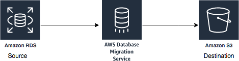

<center>

<div style="text-align: center;">

| Time of performing | Required services         |
|--------------------|---------------------------|
| 15 minutes         | AWS S3, Cloud Shell       |

</div>

</center>


## Steps

A Postgres Database hosted on RDS serves as the origin for recording
ticket sales related to sporting events. It holds transaction data
concerning ticket prices for specific individuals and the transfer of
ticket ownership, complemented by additional tables containing event
details. To accomplish a complete data transfer from the Amazon RDS
source to an Amazon S3 bucket, the AWS Database Migration Service (DMS)
is utilized.

1.  Create a bucket

2.  Open AWS CloudShell

3.  Copy the data from the staging Amazon S3 bucket to your S3 bucket

4.  Verify the data

## Step 1: Create a bucket

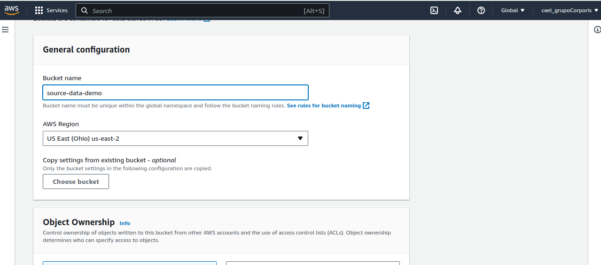

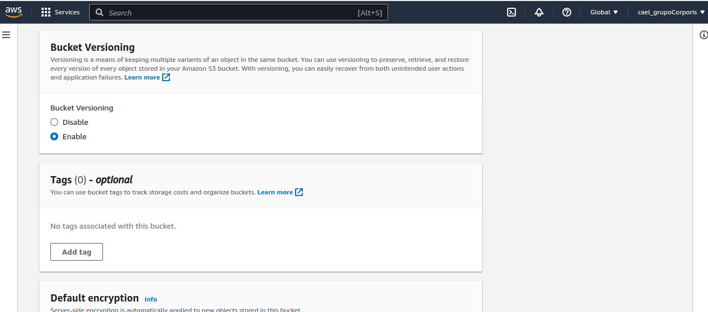

## Step 2: Open AWS CloudShell

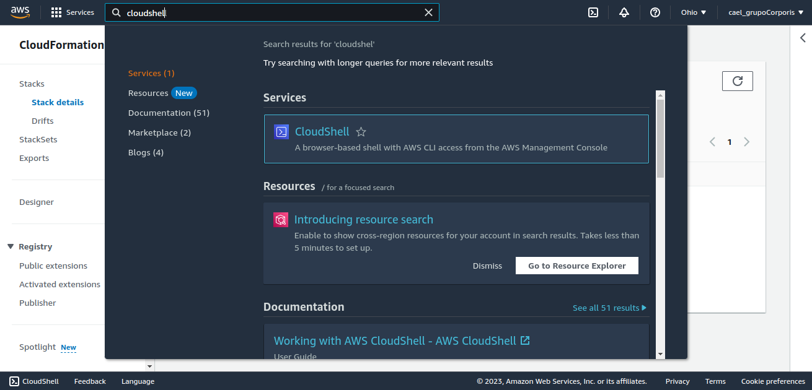

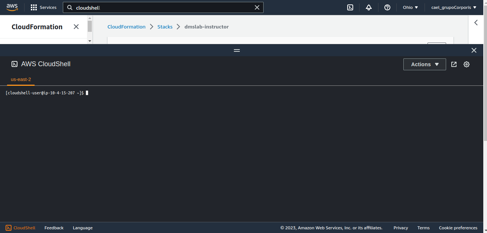

## Step 3: Copy the data from the staging Amazon S3 bucket to your S3 bucket

Replace the bucket name with your own one.

```shell

aws s3 cp \--recursive \--copy-props none
s3://aws-dataengineering-day.workshop.aws/data/
s3://source-data-demo/tickets/
```
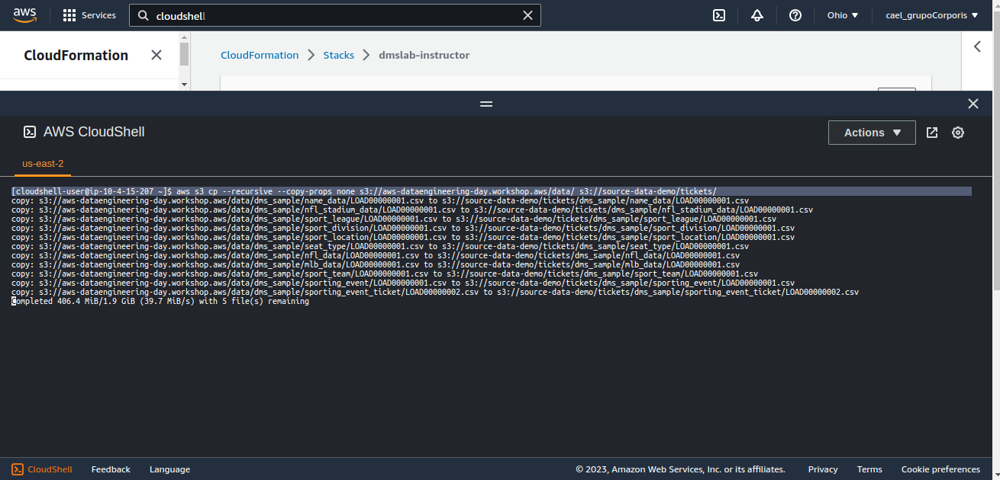

## Step 4: Verify the data

1.  Open the service S3 and view the data that was copied by cloudShell.

2.  The bucket is following the following structure:
    > BucketName/bucket_folder_name/schema_name/table_name/objects/

3.  In the present lab this is shown as:
    > **/source-data-demo/tickets/dms_sample with a separate path for
    > each table_name**

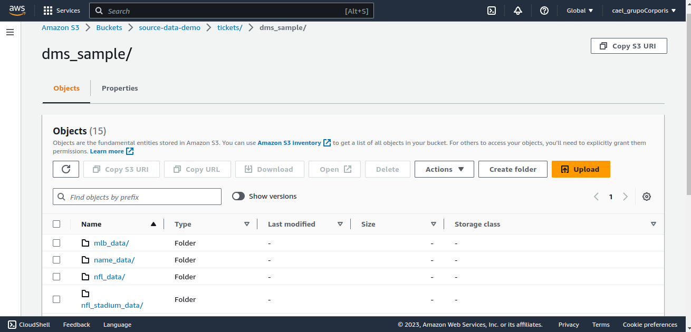

1.  Navigate to one of the files and review it using S3 querying.

    a.  Chose a table or file

> 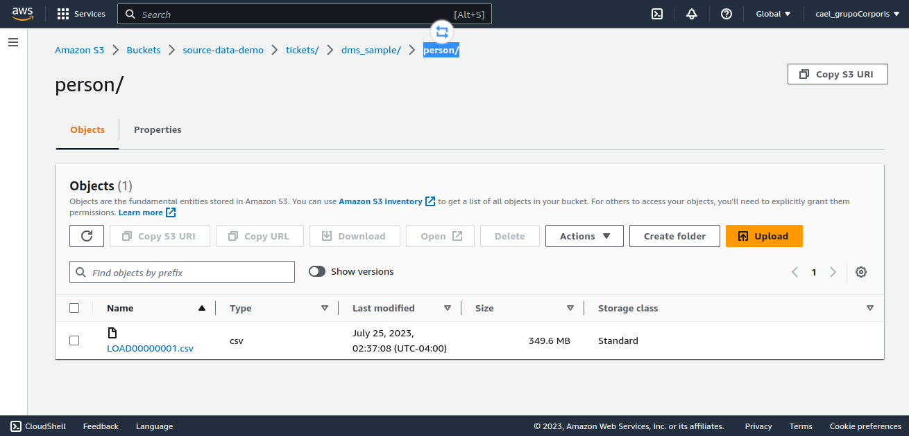

    b.  Press on actions and select "Query with S3 select"

> 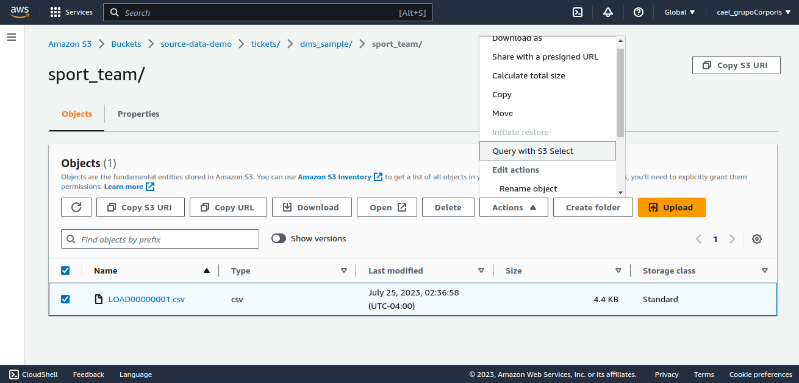

    c.  Set up the query as you need

> 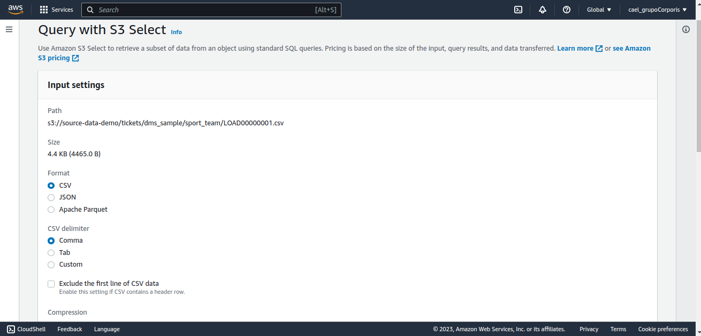

    d.  Run the query

> 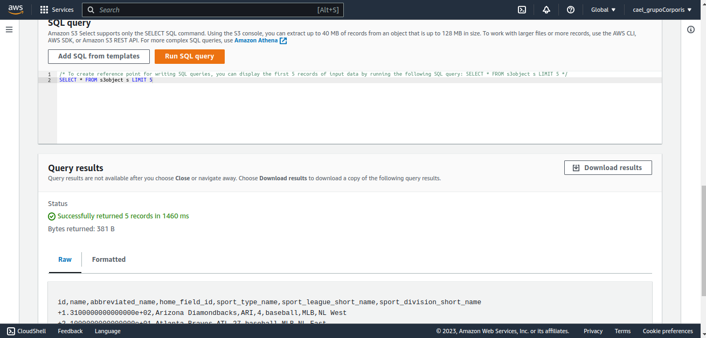

## Step 8: Clean and free up all resources used so far

## References

[Central storage: Amazon S3 as the data lake storage platform](https://docs.aws.amazon.com/whitepapers/latest/building-data-lakes/amazon-s3-data-lake-storage-platform.html)

[Best practices for AWS Database Migration Service](https://docs.aws.amazon.com/dms/latest/userguide/CHAP_BestPractices.html)

[How AWS Database Migration Service works](https://docs.aws.amazon.com/dms/latest/userguide/CHAP_Introduction.html)
