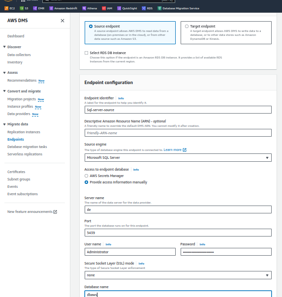

# <a name="_a9k7kceuydso"></a>Database Migration: From SQL server to S3
## <a name="_liqm59wlqcss"></a>Objectives
- **Seamless Data Replication:** Set up AWS DMS to enable seamless and efficient replication of data from the source SQL Server database to Amazon S3. Ensure the migration process is reliable, minimizing any data loss or downtime during the migration.
- **Data Transformation and Mapping:** Implement data transformation and mapping strategies within AWS DMS to ensure the data from SQL Server is accurately converted and stored in the desired format within Amazon S3. Validate the data integrity and consistency post-migration.
- **Automated Data Migration:** Design and configure an automated data migration process using AWS DMS, reducing manual intervention and human errors. Establish a scheduled migration plan to keep data in S3 up-to-date and synchronized with the SQL Server source.
## <a name="_r4lga3emmz5p"></a>Presentation

## <a name="_kbxuio8ez7bm"></a>Lab Setup


|Time of performing|Required AWS services |
| :-: | :-: |
|50 minutes|DMS, S3, VPC, EBL, EC2, IAM|
## <a name="_shwckmyqvsac"></a>Steps
1. Set up environment
1. Connect to EC2
1. Configure the source Database
1. Create DMS replication instance
1. Configure the Target S3 bucket
1. Create Source Endpoint
1. Create Target Endpoint
1. Create a DMS migration task
1. Inspect the results on S3
## <a name="_b64b6e988p3n"></a>Step 1.
Shift to E2 service and look up in the right side Key pair and create new one.


And press in create.


Now move away to VPC service and create a new one.


Verify your settings are done. 

` `

This code you should add into a file and save it as YAML. Check the file out in which  there are settings related with infrastructure, networking, security, Database instances, and others so that many resources are available for using.

```yaml
#    updating oracle source snapshot to 19c, changed RDP security group to 127.0.0.1, & added secret mgr for db Password
# Jan-2023 fixed dms subnets & updates from reinvent2022

AWSTemplateFormatVersion: '2010-09-09'
Description: CloudFormation Template for AWS Database Migration Workshop.

Metadata:
  AWS::CloudFormation::Interface:
    ParameterGroups:
      -
        Label:
          default: "Database Migration Workshop Lab Environment"
        Parameters:
          - LabType
      -
        Label:
          default: "Amazon EC2 Configuration"
        Parameters:
          - EC2ServerInstanceType
          - KeyName
      -
        Label:
          default: "Target Amazon RDS Database Configuration"
        Parameters:
          - RDSInstanceType
      -
        Label:
          default: "Network Configuration"
        Parameters:
          - VpcCIDR

Mappings:
  RegionMap: # 20 Regions
    us-east-1: # Virginia
      "EC2AMI" : "ami-03682cbe3aba12927"  # Updated  snapshot June 10, 2022 ec2 from Feb 2020
      "OracleSnapshotId" : "arn:aws:rds:us-east-1:833997227572:snapshot:dms-lab-oracle-source-sept2022-us-east-1"
    us-east-2: # Ohio
      "EC2AMI" : "ami-083d84d1b53340b9d" # Updated  snapshot June 10, 2022 ec2 from Feb 2020
      "OracleSnapshotId" : "arn:aws:rds:us-east-2:833997227572:snapshot:dms-lab-oracle-source-sept2022-us-east-2"
    us-west-2: # Oregon
      "EC2AMI" : "ami-03693ba72dc02b388" # Updated  snapshot June 10, 2022 ec2 from Feb 2020
      "OracleSnapshotId" : "arn:aws:rds:us-west-2:833997227572:snapshot:dms-lab-oracle-source-sept2022-us-west-2"
    af-south-1: # Cape Town [NO AMD]
      "EC2AMI" : "ami-06b8a1b56d1ee1741" # Updated  snapshot June 10, 2022 ec2 from Feb 2020
      "OracleSnapshotId" : "arn:aws:rds:af-south-1:833997227572:snapshot:dms-lab-oracle-source-sept2022-af-south-1"
    ap-east-1: # Hong Kong [NO AMD]
      "EC2AMI" : "ami-05497e7987c6c162a" # Updated  snapshot June 10, 2022 ec2 from Feb 2020
      "OracleSnapshotId" : "arn:aws:rds:ap-east-1:833997227572:snapshot:dms-lab-oracle-source-sept2022-ap-east-1"
    ap-south-1: # Mumbai
      "EC2AMI" : "ami-05b5700bfbbd3ff1b" # Updated  snapshot June 10, 2022 ec2 from Feb 2020
      "OracleSnapshotId" : "arn:aws:rds:ap-south-1:833997227572:snapshot:dms-lab-oracle-source-sept2022-ap-south-1"
    ap-northeast-3: # Osaka [NO AMD]
      "EC2AMI" : "ami-0a183533e54c9c538" # Updated  snapshot June 10, 2022 ec2 from Feb 2020
      "OracleSnapshotId" : "arn:aws:rds:ap-northeast-3:833997227572:snapshot:dms-lab-oracle-source-sept2022-ap-northeast-3"
    ap-northeast-2: # Seoul
      "EC2AMI" : "ami-0e6f29e7dcc938b67" # Updated  snapshot June 10, 2022 ec2 from Feb 2020
      "OracleSnapshotId" : "arn:aws:rds:ap-northeast-2:833997227572:snapshot:dms-lab-oracle-source-sept2022-ap-northeast-2"
    ap-southeast-1: # Singapore
      "EC2AMI" : "ami-01a60e6c41f658d2c" # Updated  snapshot June 10, 2022 ec2 from Feb 2020
      "OracleSnapshotId" : "arn:aws:rds:ap-southeast-1:833997227572:snapshot:dms-lab-oracle-source-sept2022-ap-southeast-1"
    ap-southeast-2: # Sydney
      "EC2AMI" : "ami-0ed88efdc0a63aa05" # Updated  snapshot June 10, 2022 ec2 from Feb 2020
      "OracleSnapshotId" : "arn:aws:rds:ap-southeast-2:833997227572:snapshot:dms-lab-oracle-source-sept2022-ap-southeast-2"
    ap-northeast-1: # Tokyo
      "EC2AMI" : "ami-000c9e3c215cb94bb" # Updated  snapshot June 10, 2022 ec2 from Feb 2020
      "OracleSnapshotId" : "arn:aws:rds:ap-northeast-1:833997227572:snapshot:dms-lab-oracle-source-sept2022-ap-northeast-1"
    ca-central-1: # Canada
      "EC2AMI" : "ami-0e8fb1647124528c8" # Updated  snapshot June 10, 2022 ec2 from Feb 2020
      "OracleSnapshotId" : "arn:aws:rds:ca-central-1:833997227572:snapshot:dms-lab-oracle-source-sept2022-ca-central-1"
    eu-central-1: # Frankfurt
      "EC2AMI" : "ami-03036a83de1124b5e" # Updated  snapshot June 10, 2022 ec2 from Feb 2020
      "OracleSnapshotId" : "arn:aws:rds:eu-central-1:833997227572:snapshot:dms-lab-oracle-source-sept2022-eu-central-1"
    eu-west-1: # Ireland
      "EC2AMI" : "ami-05ff3536cca06c530" # Updated  snapshot June 10, 2022 ec2 from Feb 2020
      "OracleSnapshotId" : "arn:aws:rds:eu-west-1:833997227572:snapshot:dms-lab-oracle-source-sept2022-eu-west-1"
    eu-west-2: # London
      "EC2AMI" : "ami-0511412a16fde520d" # Updated  snapshot June 10, 2022 ec2 from Feb 2020
      "OracleSnapshotId" : "arn:aws:rds:eu-west-2:833997227572:snapshot:dms-lab-oracle-source-sept2022-eu-west-2"
    eu-south-1: # Milan
      "EC2AMI" : "ami-0a52ffa5383fdf176" # Updated  snapshot June 10, 2022 ec2 from Feb 2020
      "OracleSnapshotId" : "arn:aws:rds:eu-south-1:833997227572:snapshot:dms-lab-oracle-source-sept2022-eu-south-1"
    eu-west-3: # Paris
      "EC2AMI" : "ami-0d61574c241c22a9f" # Updated  snapshot June 10, 2022 ec2 from Feb 2020
      "OracleSnapshotId" : "arn:aws:rds:eu-west-3:833997227572:snapshot:dms-lab-oracle-source-sept2022-eu-west-3"
    eu-north-1: # Stockholm [NO AMD]
      "EC2AMI" : "ami-0e1e14ca5aad3f5ed" # Updated snapshot June 10, 2022 ec2 from Feb 2020
      "OracleSnapshotId" : "arn:aws:rds:eu-north-1:833997227572:snapshot:dms-lab-oracle-source-sept2022-eu-north-1"
    me-south-1: # Bahrain [NO AMD]
      "EC2AMI" : "ami-0a3ba20d88f9980a4" # Updated snapshot June 10, 2022 ec2 from Feb 2020
      "OracleSnapshotId" : "arn:aws:rds:me-south-1:833997227572:snapshot:dms-lab-oracle-source-sept2022-me-south-1"
    sa-east-1: # Sao Paulo
      "EC2AMI" : "ami-083026c2d95369054" # Updated snapshot June 10, 2022 ec2 from Feb 2020
      "OracleSnapshotId" : "arn:aws:rds:sa-east-1:833997227572:snapshot:dms-lab-oracle-source-sept2022-sa-east-1"

Parameters:
  LabType:
    Description: 'Select your Database Migration lab:'
    Type: String

    AllowedValues:
      - 'Microsoft SQL Server to Amazon Aurora (MySQL)'
      - 'Microsoft SQL Server to Amazon Aurora (PostgreSQL)'
      - 'Microsoft SQL Server to Amazon RDS SQL Server'
      - 'Microsoft SQL Server to Amazon S3'
      - 'Oracle to Amazon Aurora (PostgreSQL)'
      - 'Oracle to Amazon RDS Oracle'
    ConstraintDescription: Must select a lab environment from the options.
  KeyName:
    Description: Name of an existing EC2 KeyPair to enable RDP access to the instance
    Type: AWS::EC2::KeyPair::KeyName
    ConstraintDescription: must be the name of an existing EC2 KeyPair.

  VpcCIDR:
    Description: Enter the VPC CIDR range in the form x.x.x.x/16.
    Type: String
    MinLength: 9
    MaxLength: 18
    AllowedPattern: "(\\d{1,3})\\.(\\d{1,3})\\.(\\d{1,3})\\.(\\d{1,3})/(\\d{1,2})"
    ConstraintDescription: Must be a valid CIDR range in the form x.x.x.x/16.
    Default: 10.20.0.0/16
  IAMRoleDmsVpcExist:
    Description: Does your AWS account already have dms-vpc-role(goto IAM>roles & search for "dms-vpc" to check) if this role is not there template will fail-rollback unless you change default Y to N?
    Type: String
    Default: Y
    AllowedValues:
      - Y
      - N
  EC2ServerInstanceType:
    Description: Amazon EC2 Instance Type
    Type: String
    Default: m5.xlarge
    AllowedValues:
      - m5.large
      - m5.xlarge
      - m5.2xlarge
      - m5.4xlarge
      - m5a.large
      - m5a.xlarge
      - m5a.2xlarge
      - m5a.4xlarge
    ConstraintDescription: Must be a valid EC2 instance type.
  RDSInstanceType:
    Description: Amazon RDS Aurora Instance Type
    Type: String
    Default: db.r5.xlarge
    AllowedValues:
      - db.r5.large
      - db.r5.xlarge
      - db.r5.2xlarge
      - db.r5.4xlarge
    ConstraintDescription: Must be a valid Amazon RDS instance type.

Conditions:
  Create-SQLServer-to-AuroraMySQL-Environment: !Equals [ !Ref LabType, 'Microsoft SQL Server to Amazon Aurora (MySQL)' ]
  Create-SQLServer-to-RDSSQLServer-Environment: !Equals [ !Ref LabType, 'Microsoft SQL Server to Amazon RDS SQL Server' ]
  Create-SQLServer-to-AuroraPostgreSQL-Environment: !Equals [ !Ref LabType, 'Microsoft SQL Server to Amazon Aurora (PostgreSQL)' ]
  Create-SQLServer-to-S3-Environment: !Equals [ !Ref LabType, 'Microsoft SQL Server to Amazon S3']
  Create-Oracle-to-AuroraPostgreSQL-Environment: !Equals [ !Ref LabType, 'Oracle to Amazon Aurora (PostgreSQL)' ]
  Create-Oracle-to-RDSOracle-Environment: !Equals [ !Ref LabType, 'Oracle to Amazon RDS Oracle' ]
  Create-Oracle-Environment: !Or [!Equals [ !Ref LabType, 'Oracle to Amazon Aurora (PostgreSQL)'], !Equals [ !Ref LabType, 'Oracle to Amazon RDS Oracle'] ]
  IAMRoleDmsVpcExist: !Equals [!Ref IAMRoleDmsVpcExist, 'N']

Resources:
  DmsVpc:
    Type: AWS::EC2::VPC
    Properties:
      EnableDnsSupport: 'true'
      EnableDnsHostnames: 'true'
      CidrBlock:
        Ref: VpcCIDR
      Tags:
      - Key: Name
        Value:
          Fn::Join:
          - "-"
          - - Ref: AWS::StackName
            - DmsVpc
  Subnet1:
    Type: AWS::EC2::Subnet
    Properties:
      VpcId: !Ref DmsVpc
      CidrBlock: !Select [ 0, !Cidr [ !GetAtt DmsVpc.CidrBlock, 3, 8 ]]
      AvailabilityZone: !Select [0, !GetAZs ]
      Tags:
      - Key: Name
        Value:
          Fn::Join:
          - "-"
          - - Ref: AWS::StackName
            - Subnet1
  Subnet2:
    Type: AWS::EC2::Subnet
    Properties:
      VpcId: !Ref DmsVpc
      CidrBlock: !Select [ 1, !Cidr [ !GetAtt DmsVpc.CidrBlock, 3, 8 ]]
      AvailabilityZone: !Select [1, !GetAZs ]
      Tags:
      - Key: Name
        Value:
          Fn::Join:
          - "-"
          - - Ref: AWS::StackName
            - Subnet2
  Subnet3:
    Type: AWS::EC2::Subnet
    Properties:
      VpcId: !Ref DmsVpc
      CidrBlock: !Select [ 2, !Cidr [ !GetAtt DmsVpc.CidrBlock, 3, 8 ]]
      AvailabilityZone: !Select [2, !GetAZs ]
      Tags:
      - Key: Name
        Value:
          Fn::Join:
          - "-"
          - - Ref: AWS::StackName
            - Subnet3
  DBSubnetGroup:
    Type: AWS::RDS::DBSubnetGroup
    Properties:
      DBSubnetGroupDescription: Subnets available for the DMS Lab
      SubnetIds:
      - Ref: Subnet1
      - Ref: Subnet2
      - Ref: Subnet3
  InternetGateway:
    Type: AWS::EC2::InternetGateway
    Properties:
      Tags:
      - Key: Name
        Value:
          Fn::Join:
          - "-"
          - - Ref: AWS::StackName
            - InternetGateway
  AttachGateway:
    Type: AWS::EC2::VPCGatewayAttachment
    Properties:
      VpcId: !Ref DmsVpc
      InternetGatewayId: !Ref InternetGateway
  RouteTable:
    Type: AWS::EC2::RouteTable
    Properties:
      VpcId: !Ref DmsVpc
      Tags:
      - Key: Name
        Value:
          Fn::Join:
          - "-"
          - - Ref: AWS::StackName
            - RouteTable
  Route:
    Type: AWS::EC2::Route
    DependsOn: AttachGateway
    Properties:
      RouteTableId: !Ref RouteTable
      DestinationCidrBlock: 0.0.0.0/0
      GatewayId: !Ref InternetGateway
  Subnet1RouteTableAssociation:
    Type: AWS::EC2::SubnetRouteTableAssociation
    Properties:
      SubnetId: !Ref Subnet1
      RouteTableId: !Ref RouteTable
  Subnet2RouteTableAssociation:
    Type: AWS::EC2::SubnetRouteTableAssociation
    Properties:
      SubnetId: !Ref Subnet2
      RouteTableId: !Ref RouteTable
  Subnet3RouteTableAssociation:
    Type: AWS::EC2::SubnetRouteTableAssociation
    Properties:
      SubnetId: !Ref Subnet3
      RouteTableId: !Ref RouteTable
  S3GatewayEndpoint:
    Type: 'AWS::EC2::VPCEndpoint'
    Properties:
      PolicyDocument:
        Version: 2012-10-17
        Statement:
          - Effect: Allow
            Principal: '*'
            Action:
              - 's3:GetObject'
              - 's3:PutObject'
              - 's3:DeleteObject'
              - 's3:PutObjectTagging'
              - 's3:ListBucket'
            Resource:
              - 'arn:aws:s3:::*'
            Condition:
              StringEquals:
                aws:sourceVpc: !Ref DmsVpc

      RouteTableIds:
        - !Ref RouteTable
#        - !Ref routetableB
      ServiceName: !Sub 'com.amazonaws.${AWS::Region}.s3'
      VpcId: !Ref DmsVpc
  DMSVpcRole:
    Type: AWS::IAM::Role
    Condition: IAMRoleDmsVpcExist
    Properties:
      RoleName: dms-vpc-role
      AssumeRolePolicyDocument:
        Version: '2012-10-17'
        Statement:
        - Effect: Allow
          Principal:
            Service:
            - dms.amazonaws.com
          Action:
          - sts:AssumeRole
      ManagedPolicyArns:
      - arn:aws:iam::aws:policy/service-role/AmazonDMSVPCManagementRole
      Path: "/"

  AllInstanceIdsAssociation:
    Type: AWS::SSM::Association
    Properties:
      AssociationName: UpdateSSMAgent
      Name: AWS-UpdateSSMAgent
      ScheduleExpression: cron(0 2 ? * SUN *)
      Targets:
      - Key: InstanceIds
        Values:
        - "*"
      WaitForSuccessTimeoutSeconds: 300
  Ec2SsmIamRole:
    Type: AWS::IAM::Role
    Properties: 
      AssumeRolePolicyDocument: 
        Statement:
          - Effect: Allow
            Principal:
              Service: [ec2.amazonaws.com]
            Action: ['sts:AssumeRole']
      Path: /
      ManagedPolicyArns:
        - arn:aws:iam::aws:policy/service-role/AmazonEC2RoleforSSM
      RoleName: 
        Fn::Join:
          - "-"
          - - Ref: AWS::StackName
            - EC2smIAMRole


  Ec2SsmInstanceProfile:
    Type: AWS::IAM::InstanceProfile
    Properties: 
      Path: /
      Roles: [!Ref Ec2SsmIamRole]


  EC2Instance:
    Type: AWS::EC2::Instance
    Properties:
      InstanceType: !Ref EC2ServerInstanceType
      KeyName: !Ref KeyName
      IamInstanceProfile: !Ref Ec2SsmInstanceProfile
      Tags:
      - Key: Name
        Value:
          Fn::Join:
          - "-"
          - - Ref: AWS::StackName
            - EC2Instance
      BlockDeviceMappings:
      - DeviceName: "/dev/sda1"
        Ebs:
          DeleteOnTermination: 'true'
          Iops: '2000'
          VolumeSize: '250'
          VolumeType: io1
      ImageId:
        Fn::FindInMap:
        - RegionMap
        - !Ref AWS::Region
        - EC2AMI
      NetworkInterfaces:
      - AssociatePublicIpAddress: 'true'
        DeleteOnTermination: 'true'
        DeviceIndex: 0
        SubnetId: !Ref Subnet2
        GroupSet:
        - Ref: InstanceSecurityGroup
  InstanceSecurityGroup:
    Type: AWS::EC2::SecurityGroup
    Properties:
      Tags:
      - Key: Name
        Value:
          Fn::Join:
          - "-"
          - - Ref: AWS::StackName
            - InstanceSecurityGroup
      GroupDescription: Enable RDP access via port 3389
      VpcId: !Ref DmsVpc
      SecurityGroupIngress:
      - IpProtocol: tcp
        FromPort: '3389'
        ToPort: '3389'
        CidrIp: 127.0.0.1/32
        Description: Allows RDP access to EC2 Instance
      - IpProtocol: tcp
        FromPort: '1521'
        ToPort: '1521'
        CidrIp: !Ref VpcCIDR
        Description: Allows Amazon RDS Oracle Access
      - IpProtocol: tcp
        FromPort: '5432'
        ToPort: '5432'
        CidrIp: !Ref VpcCIDR
        Description: Allows Amazon RDS Aurora (PostgreSQL) Access
      - IpProtocol: tcp
        FromPort: '1433'
        ToPort: '1433'
        CidrIp: !Ref VpcCIDR
        Description: Allows SQL Server Access
      - IpProtocol: tcp
        FromPort: '3306'
        ToPort: '3306'
        CidrIp: !Ref VpcCIDR
        Description: Allows Amazon RDS Aurora (MySQL) Access

  ReplicationInstanceSubnetGroup:
    Type: AWS::DMS::ReplicationSubnetGroup
    Properties:
      ReplicationSubnetGroupDescription: !Sub '${AWS::StackName} DMS Subnet Group'
      ReplicationSubnetGroupIdentifier: !Sub '${AWS::StackName}-dms-subnet-group'
      SubnetIds: 
        - !Ref Subnet1
        - !Ref Subnet2
        - !Ref Subnet2
      Tags:
          - Key: Name
            Value: !Sub '${AWS::StackName}-dms-subnet-group'

  DMSDBSecret:
    Type: 'AWS::SecretsManager::Secret'
    Properties:
      Name: 
        Fn::Join:
          - "-"
          - - Ref: AWS::StackName
            - DMSDBSecret
      Description: This secret has a hardcoded password in SecretString
      SecretString: '{"username":"dbmaster","password":"dbmaster123","SQLServerMySQLusername":"awssct","SQLServerMySQLpassword":"Password1"}'
      Tags:
      - Key: Name
        Value:
          Fn::Join:
          - "-"
          - - Ref: AWS::StackName
            - DMSDBSecret

  SourceOracleDB:
    Condition: Create-Oracle-Environment
    Type: AWS::RDS::DBInstance
    DeletionPolicy: Delete
    Properties:
      Tags:
      - Key: Name
        Value:
          Fn::Join:
          - "-"
          - - Ref: AWS::StackName
            - SourceOracleDB
      DBName: 'OracleDB'
      AllocatedStorage: '400'
      StorageType: gp2
      MasterUsername: 'dbmaster'
      MasterUserPassword: 'dbmaster123'
      DBInstanceClass: !Ref RDSInstanceType
      Engine: oracle-ee
      EngineVersion: '19.0.0.0.ru-2022-04.rur-2022-04.r1'
      LicenseModel: bring-your-own-license
      PubliclyAccessible: false
      AvailabilityZone:
        Fn::GetAtt:
          - Subnet2
          - AvailabilityZone
      MultiAZ: false
      DBSubnetGroupName:
        Ref: DBSubnetGroup
      VPCSecurityGroups:
        - Fn::GetAtt:
          - OracleSourceSecurityGroup
          - GroupId
      DBSnapshotIdentifier:
        Fn::FindInMap:
          - RegionMap
          - !Ref AWS::Region
          - OracleSnapshotId
      DBInstanceIdentifier:
        Fn::Join:
        - "-"
        - - Ref: AWS::StackName
          - SourceOracleDB
  OracleSourceSecurityGroup:
    Condition: Create-Oracle-Environment
    Type: AWS::EC2::SecurityGroup
    Properties:
      Tags:
      - Key: Name
        Value:
          Fn::Join:
          - "-"
          - - Ref: AWS::StackName
            - OracleSourceSecurityGroup
      GroupDescription: Security group for Source Oracle Instance.
      VpcId: !Ref DmsVpc
      SecurityGroupIngress:
      - IpProtocol: tcp
        FromPort: '1521'
        ToPort: '1521'
        CidrIp: !Ref VpcCIDR
        Description: Allows Amazon RDS Oracle Access
  RDSSecurityGroup:
    Type: AWS::EC2::SecurityGroup
    Properties:
      Tags:
      - Key: Name
        Value:
          Fn::Join:
          - "-"
          - - Ref: AWS::StackName
            - RDSSecurityGroup
      VpcId: !Ref DmsVpc
      GroupDescription: Amazon Aurora RDS Security Group.
      SecurityGroupIngress:
      - IpProtocol: tcp
        FromPort: '5432'
        ToPort: '5432'
        CidrIp: !Ref VpcCIDR
        Description: Allows Amazon RDS Aurora (PostgreSQL) Access
      - IpProtocol: tcp
        FromPort: '3306'
        ToPort: '3306'
        CidrIp: !Ref VpcCIDR
        Description: Allows Amazon RDS Aurora (MySQL) Access
      - IpProtocol: tcp
        FromPort: '1433'
        ToPort: '1433'
        CidrIp: !Ref VpcCIDR
        Description: Allows Microsoft SQL Server Access
      - IpProtocol: tcp
        FromPort: '1521'
        ToPort: '1521'
        CidrIp: !Ref VpcCIDR
        Description: Allows Oracle Access
  
  AuPGClusterParametergroup:
    Type: AWS::RDS::DBClusterParameterGroup
    Properties:
      Description: "Aurora Postgresql Custom paramater group"
      Family: "aurora-postgresql14"
      Parameters:
         rds.babelfish_status: 'on'
         babelfishpg_tsql.migration_mode: 'multi-db'
         shared_preload_libraries: 'pg_stat_statements,pg_hint_plan'
      Tags:
      - Key: Name
        Value:
          Fn::Join:
          - "-"
          - - Ref: AWS::StackName
            - AuPGClusterParams
## Create parameter groups for cluster nodes
  AuPGNodeParams:
    Type: AWS::RDS::DBParameterGroup
    Properties:
      Description: "Aurora Postgresql Custom paramater group"
      Family: "aurora-postgresql14"
      Parameters:
        log_rotation_age: '1440'
        log_rotation_size: '102400'
      Tags:
      - Key: Name
        Value:
          Fn::Join:
          - "-"
          - - Ref: AWS::StackName
            - AuPGNodeParams
  
  AuroraPostgresqlCluster:
    Condition: Create-Oracle-to-AuroraPostgreSQL-Environment
    Type: AWS::RDS::DBCluster
    DeletionPolicy: Delete
    Properties:
      Tags:
      - Key: Name
        Value:
          Fn::Join:
          - "-"
          - - Ref: AWS::StackName
            - AuroraPostgresqlCluster
      DBSubnetGroupName:
        Ref: DBSubnetGroup
      VpcSecurityGroupIds:
      - Fn::GetAtt:
        - RDSSecurityGroup
        - GroupId
      DatabaseName: 'AuroraDB'
      Engine: aurora-postgresql
#      EngineMode: serverless
      EngineVersion: '14.5'
      #DBClusterParameterGroupName: default.aurora-postgresql13
      DBClusterParameterGroupName: !Ref AuPGClusterParametergroup
      MasterUsername: 'dbmaster'
      MasterUserPassword: 'dbmaster123'
      Port: '5432'
      BackupRetentionPeriod: '1'
      ServerlessV2ScalingConfiguration:
        MinCapacity: 1
        MaxCapacity: 32
    DependsOn: RDSSecurityGroup
  AuroraPostgresqlInstance:
    Condition: Create-Oracle-to-AuroraPostgreSQL-Environment
    Type: AWS::RDS::DBInstance
    DeletionPolicy: Delete
    Properties:
      Tags:
      - Key: Name
        Value:
          Fn::Join:
          - "-"
          - - Ref: AWS::StackName
            - AuroraPostgresqlInstance
      DBClusterIdentifier:
        Ref: AuroraPostgresqlCluster
      DBInstanceIdentifier:
        Fn::Join:
        - "-"
        - - Ref: AWS::StackName
          - AuroraPostgreSQLInstance
      Engine: aurora-postgresql
      EngineVersion: '14.5'
      DBParameterGroupName: !Ref AuPGNodeParams
      #DBParameterGroupName: default.aurora-postgresql14
      DBClusterIdentifier:
        Ref: AuroraPostgresqlCluster
      DBSubnetGroupName:
        Ref: DBSubnetGroup
      AutoMinorVersionUpgrade: 'true'
      CopyTagsToSnapshot: 'true'
      #DBInstanceClass: !Ref RDSInstanceType
      DBInstanceClass: db.serverless
      PubliclyAccessible: 'false'
    DependsOn: AuPGNodeParams
  AuroraPostgresqlCluster2:
    Condition: Create-SQLServer-to-AuroraPostgreSQL-Environment
    Type: AWS::RDS::DBCluster
    DeletionPolicy: Delete
    Properties:
      Tags:
      - Key: Name
        Value:
          Fn::Join:
          - "-"
          - - Ref: AWS::StackName
            - AuroraPostgresqlCluster2
      DBSubnetGroupName:
        Ref: DBSubnetGroup
      VpcSecurityGroupIds:
      - Fn::GetAtt:
        - RDSSecurityGroup
        - GroupId
      DatabaseName: 'AuroraDB'
      Engine: aurora-postgresql
      EngineVersion: '14.5'
      #DBClusterParameterGroupName: default.aurora-postgresql13
      DBClusterParameterGroupName: !Ref AuPGClusterParametergroup
      MasterUsername: 'dbmaster'
      MasterUserPassword: 'dbmaster123'
      Port: '5432'
      BackupRetentionPeriod: '1'
      ServerlessV2ScalingConfiguration:
        MinCapacity: 1
        MaxCapacity: 32
    DependsOn: RDSSecurityGroup
  AuroraPostgresqlInstance2:
    Condition: Create-SQLServer-to-AuroraPostgreSQL-Environment
    Type: AWS::RDS::DBInstance
    DeletionPolicy: Delete
    Properties:
      Tags:
      - Key: Name
        Value:
          Fn::Join:
          - "-"
          - - Ref: AWS::StackName
            - AuroraPostgresqlInstance2
      DBClusterIdentifier:
        Ref: AuroraPostgresqlCluster2
      DBInstanceIdentifier:
        Fn::Join:
        - "-"
        - - Ref: AWS::StackName
          - AuroraPostgreSQLInstance2
      Engine: aurora-postgresql
      EngineVersion: '14.5'
      #DBParameterGroupName: default.aurora-postgresql13
      DBParameterGroupName: !Ref AuPGNodeParams
      DBClusterIdentifier:
        Ref: AuroraPostgresqlCluster2
      DBSubnetGroupName:
        Ref: DBSubnetGroup
      AutoMinorVersionUpgrade: 'true'
      CopyTagsToSnapshot: 'true'
      #DBInstanceClass: !Ref RDSInstanceType
      DBInstanceClass: db.serverless
      PubliclyAccessible: 'false'
  AuroraMySQLCluster:
    Condition: Create-SQLServer-to-AuroraMySQL-Environment
    Type: AWS::RDS::DBCluster
    DeletionPolicy: Delete
    Properties:
      Tags:
      - Key: Name
        Value:
          Fn::Join:
          - "-"
          - - Ref: AWS::StackName
            - AuroraMySQLCluster
      DBSubnetGroupName:
        Ref: DBSubnetGroup
      VpcSecurityGroupIds:
      - Fn::GetAtt:
        - RDSSecurityGroup
        - GroupId
      DatabaseName: AuroraMySQL
      Engine: aurora-mysql
      EngineVersion: 8.0.mysql_aurora.3.02.2
      MasterUsername: awssct
      MasterUserPassword: Password1
      ServerlessV2ScalingConfiguration:
        MinCapacity: 1
        MaxCapacity: 32

    DependsOn: RDSSecurityGroup
  AuroraMySQLInstance:
    Condition: Create-SQLServer-to-AuroraMySQL-Environment
    Type: AWS::RDS::DBInstance
    DeletionPolicy: Delete
    Properties:
      Tags:
      - Key: Name
        Value:
          Fn::Join:
          - "-"
          - - Ref: AWS::StackName
            - AuroraMySQLInstance
      DBClusterIdentifier:
        Ref: AuroraMySQLCluster
      DBInstanceIdentifier:
        Fn::Join:
        - "-"
        - - Ref: AWS::StackName
          - AuroraMySQLInstance
      DBSubnetGroupName:
        Ref: DBSubnetGroup
#      DBInstanceClass: !Ref RDSInstanceType
      DBInstanceClass: db.serverless
      Engine: aurora-mysql
      EngineVersion: 8.0.mysql_aurora.3.02.2
      LicenseModel: general-public-license
      PubliclyAccessible: 'false'
  TargetSQLServer:
    Condition: Create-SQLServer-to-RDSSQLServer-Environment
    Type: AWS::RDS::DBInstance
    DeletionPolicy: Delete
    Properties:
      Tags:
      - Key: Name
        Value:
          Fn::Join:
          - "-"
          - - Ref: AWS::StackName
            - AuroraMySQLInstance
      DBSubnetGroupName:
        Ref: DBSubnetGroup
      VPCSecurityGroups:
      - Fn::GetAtt:
        - RDSSecurityGroup
        - GroupId
      DBInstanceIdentifier:
        Fn::Join:
        - "-"
        - - Ref: AWS::StackName
          - TargetSQLServer
      LicenseModel: license-included
      Engine: sqlserver-se
      EngineVersion: 15.00.4073.23.v1
      DBInstanceClass: !Ref RDSInstanceType
      AllocatedStorage: '100'
      Iops: '2000'
      MasterUsername: awssct
      MasterUserPassword: Password1
      PubliclyAccessible: 'false'
      BackupRetentionPeriod: '0'
    DependsOn: RDSSecurityGroup
  TargetOracleDB:
    Condition: Create-Oracle-to-RDSOracle-Environment
    Type: AWS::RDS::DBInstance
    DeletionPolicy: Delete
    Properties:
      Tags:
      - Key: Name
        Value:
          Fn::Join:
          - "-"
          - - Ref: AWS::StackName
            - TargetOracleDB
      DBName: 'TargetDB'
      AllocatedStorage: '400'
      StorageType: gp2
      MasterUsername: 'dbmaster'
      MasterUserPassword: 'dbmaster123'
      DBInstanceClass: !Ref RDSInstanceType
      Engine: oracle-ee
      EngineVersion: '19.0.0.0.ru-2022-04.rur-2022-04.r1'
      LicenseModel: bring-your-own-license
      PubliclyAccessible: false
      AvailabilityZone:
        Fn::GetAtt:
          - Subnet2
          - AvailabilityZone
      MultiAZ: false
      DBSubnetGroupName:
        Ref: DBSubnetGroup
      VPCSecurityGroups:
        - Fn::GetAtt:
          - RDSSecurityGroup
          - GroupId
      DBInstanceIdentifier:
        Fn::Join:
        - "-"
        - - Ref: AWS::StackName
          - TargetOracleDB

Outputs:

  DMSDBSecretU:
    Description:  DB Username
    Value: dbmaster
  DMSDBSecretP:
    Description:  DB Pwd
    Value: dbmaster123
  DMSDBSecretUSQLSERVER:
    Description:  DB Username SQL Server & MySQL
    Value: awssct
  DMSDBSecretPSQLSERVER:
    Description:  DB Pwd SQL Server & MySQL
    Value: Password1

  SourceEC2PublicDNS:
    Description: Public DNS enpoint for the EC2 instance
    Value:
      Fn::GetAtt:
      - EC2Instance
      - PublicDnsName
  SourceEC2PrivateDNS:
    Description: Private DNS endpoint for the EC2 instance
    Value:
      Fn::GetAtt:
      - EC2Instance
      - PrivateDnsName
  SourceOracleEndpoint:
    Condition: Create-Oracle-Environment
    Description: Source Oracle RDS Endpoint
    Value:
      Fn::GetAtt:
      - SourceOracleDB
      - Endpoint.Address
  TargetAuroraPostgreSQLEndpoint:
    Condition: Create-Oracle-to-AuroraPostgreSQL-Environment
    Description: Target Aurora (PostgreSQL) Database Endpoint
    Value:
      Fn::GetAtt:
      - AuroraPostgresqlCluster
      - Endpoint.Address
  YourTargetAuroraPostgreSQLEndpoint:
    Condition: Create-SQLServer-to-AuroraPostgreSQL-Environment
    Description: Target Aurora (PostgreSQL) Database Endpoint
    Value:
      Fn::GetAtt:
      - AuroraPostgresqlCluster2
      - Endpoint.Address
  TargetAuroraMySQLEndpoint:
    Condition: Create-SQLServer-to-AuroraMySQL-Environment
    Description: Target Aurora (MySQL) Database Endpoint
    Value:
      Fn::GetAtt:
      - AuroraMySQLInstance
      - Endpoint.Address
  TargetSQLServerEndpoint:
    Condition: Create-SQLServer-to-RDSSQLServer-Environment
    Description: Target MS SQL Server RDS Endpoint
    Value:
      Fn::GetAtt:
      - TargetSQLServer
      - Endpoint.Address
  TargetOracleEndpoint:
    Condition: Create-Oracle-to-RDSOracle-Environment
    Description: Target Oracle RDS Instance Endpoint
    Value:
      Fn::GetAtt:
      - TargetOracleDB
      - Endpoint.Address
```

Get into **CloudFormation** and create a new stack. Choose **Upload file** and add the file with the code within.


After choosing the file, press next, set up the following options that are given in forward steps, and finally create a stack.


|**Input Parameter**|**Values**|
| :-: | :-: |
|Stack Name|A unique identifier without spaces.|
|MigrationType / Lab Type|Database that you want to migrate (Oracle or SQL Server).|
|EC2ServerInstanceType|An Amazon EC2 Instance type from the drop-down menu. Recommend using the default value.|
|KeyName|The KeyPair (DMSKeypair) that you created in the previous step.|
|RDSInstanceType|An Amazon RDS Instance type from the drop-down menu. Recommend using the default value.|
|VpcCIDR|The VPC CIDR range in the form x.x.x.x/16. Defaults to 10.20.0.0/16|
|IAMRoleDmsVpcExist|Does your AWS account already have dms-vpc-role(goto IAM>roles & search for "dms-vpc" to check) if this role is not there template will fail-rollback unless you change default Y to N?|


Once created, check the status of the stack.


## <a name="_lsk85whcyi23"></a>Step 2. 

Move around within EC2 to **Network & Security** and choose Security group. Once created a VPC service, a security groups has been created along this. Select the instance security and edit inbound rules.


Add a rule for RDP (Remote Desktop Protocol) connections allowing for anywhere or a own IP, then save editions. 


On the right side, choose the Instance option and select what you are working on. Press on the top bar in Connect.


Switch to RDP client. Download the RDP file. Generate the password to log in into the SQL server.


When the file has been finished downloading, launch it and type the password that has been generated for logging in.


## <a name="_3mirndzhjp41"></a>Step 3. 

Upon open the database server, paste this query to create a relational database and import data into a query editor.

```sql
--Set master database context
use [master]
GO

--Add the awssct login to the sysadmin server role - required for replication
ALTER SERVER ROLE [sysadmin] ADD MEMBER [awssct]
GO

--Set the recovery model to full for dms_sample - required for replication
ALTER DATABASE [dms_sample] SET RECOVERY FULL WITH NO_WAIT
GO

--Configure this SQL Server as its own distributor
exec sp_adddistributor @distributor = @@SERVERNAME, @password = N'Password1'
exec sp_adddistributiondb @database = N'distribution', @data_folder = N'C:\Program Files\Microsoft SQL Server\MSSQL14.MSSQLSERVER\MSSQL\DATA', @log_folder = N'C:\Program Files\Microsoft SQL Server\MSSQL14.MSSQLSERVER\MSSQL\Data', @log_file_size = 2, @min_distretention = 0, @max_distretention = 72, @history_retention = 48, @security_mode = 1
GO

--Change context to the distribution database
use [distribution] 
GO

--Configure replication
if (not exists (select * from sysobjects where name = 'UIProperties' and type = 'U ')) 
	create table UIProperties(id int) 

if (exists (select * from ::fn_listextendedproperty('SnapshotFolder', 'user', 'dbo', 'table', 'UIProperties', null, null))) 
	EXEC sp_updateextendedproperty N'SnapshotFolder', N'C:\Program Files\Microsoft SQL Server\MSSQL14.MSSQLSERVER\MSSQL\ReplData', 'user', dbo, 'table', 'UIProperties' 
else 
	EXEC sp_addextendedproperty N'SnapshotFolder', N'C:\Program Files\Microsoft SQL Server\MSSQL14.MSSQLSERVER\MSSQL\ReplData', 'user', dbo, 'table', 'UIProperties'
GO

exec sp_adddistpublisher @publisher = @@SERVERNAME, @distribution_db = N'distribution', @security_mode = 1, @working_directory = N'C:\Program Files\Microsoft SQL Server\MSSQL14.MSSQLSERVER\MSSQL\ReplData', @trusted = N'false', @thirdparty_flag = 0, @publisher_type = N'MSSQLSERVER'
GO
```


## <a name="_p63q375p9bus"></a>Step 4. 

Search for DMS service in the searcher. The following diagram depicts how it will be configured to receive and store data. First off, an instance has to be created.


Create a new instance for DMS by following the below suggested settings.


|**Parameter**|**Value**|
| :-: | :-: |
|Name|DMSReplication|
|Descriptive Amazon Resource name(ARN)|leave blank|
|Description|Replication server for Database Migration|
|Instance Class|dms.c5.xlarge|
|Engine version|Leave the default value|
|Allocated storage (GB)|50|
|VPC|<VPC ID from Environment Setup Step>|
|Multi-AZ|Dev or Test workload(Single-AZ)|
|Publicly accessible|No|
|Advanced -> VPC Security Group(s)|default|

Wait until the status of the instance switch for Running.


## <a name="_5kygxjxlr9xz"></a>Step 5. 
From the previous step, we have to implement S3 bucket and a file to respectively receive data from SQL server.


Go to the IAM service and add to the VPC role (that has been created for managing the isolated instance) and add right permissions got grant access to S3. FInd the role.


Click on the role and add permission as JSON. 


An editor is displayed. Fill up with the JSON script below and press save.


```json
{
  "Version": "2012-10-17",
  "Statement": [
    {
      "Effect": "Allow",
      "Action": [
        "s3:PutObject",
        "s3:DeleteObject"
      ],
      "Resource": [
        "arn:aws:s3:::destination-data-demo/\*"
      ]
    },
    {
      "Effect": "Allow",
      "Action": [
        "s3:ListBucket"
      ],
      "Resource": [
        "arn:aws:s3:::destination-data-demo"
      ]
    },
    {
      "Effect": "Allow",
      "Action": [
        "s3:GetBucketLocation",
        "s3:GetObject",
        "s3:ListBucketMultipartUploads",
        "s3:AbortMultipartUpload",
        "s3:ListMultipartUploadParts"
      ],
      "Resource": [
        "arn:aws:s3:::destination-data-demo",
        "arn:aws:s3:::destination-data-demo/\*"
      ]
    }
  ]
}

```

## <a name="_6qcyxv34k1y3"></a>Step 6.
Back to the DMS service and on the right side, push the **Endpoints** option. Create a new one.


Choose for Source endpoint and establish the following parameters.


|**Parameter**|**Value**|
| :-: | :-: |
|Endpoint Type|Source endpoint|
|Endpoint Identifier|sqlserver-source|
|Descriptive Amazon Resource Name|leave blank|
|Source Engine|Microsoft SQL Server|
|Access to Endpoint database Radio Button|Select/click Provide access information Manually|
|Server Name|< SourceEC2PrivateDns >|
|Port|1433|
|SSL Mode|none|
|User Name|awssct|
|Password|See Cloudformation Output tab & DMSDBSecretPSQLServer or look it up in AWS Secrets Manager for SQL Server|
|Database Name|dms\_sample|
|Test endpoint connection -> VPC|< VPC ID from Environment Setup Step >|
|Replication Instance|DMSReplication|

Upon filling up is done, review it, and save it.


## <a name="_b3bxto9yjukf"></a>Step 7.
A new endpoint have to be created to transfer files to S3. Press on **Target endpoint**.


Set up the fields and stablich these configurations.

|**Parameter**|**Value**|
| :-: | :-: |
|Endpoint Type|Target endpoint|
|Descriptive Amazon Resource Name|leave blank|
|Endpoint Identifier|S3-target|
|Source Engine|S3|
|Server Name|< ARN of the dms-vpc-role >|
|Bucket Name|< Name of Your S3 Bucket >|
|Bucket folder|dmstargetfolder|

After reviewing them, It is a good practice to test that the connection for the intended S3 bucket is accordingly. That’s why press on Test before launching the endpoint.


## <a name="_4wq1gkdlmsm6"></a>Step 8.
While the instance and endpoints (source and target) have been established and are waiting for being activated by a task, let’s create a new one.


For the below options, be careful with next settings because they will define the kind of replication, monitoring, periods, or times regarding migration service.


Here are the suggested settings to this training.

|**Parameter**|**Value**|
| :-: | :-: |
|Task identifier|SampleMigrationTask|
|Replication instance|DMSReplication|
|Source database endpoint|sqlserver-source|
|Target database endpoint|S3-target|
|Migration type|Migrate existing data and replicate ongoing changes|
|CDC stop mode|Don’t use custom CDC stop mode|
|Target table preparation mode|Do nothing|
|Stop task after full load completes|Don’t stop|
|Include LOB columns in replication|Limited LOB mode|
|Max LOB size (KB)|32|
|Enable validation|Unchecked|
|Enable CloudWatch logs|Checked|

On the **Mapping** option, ensure of selecting the right schema. Here, choose for **dbo.**


|**Parameter**|**Value**|
| :-: | :-: |
|Schema|dbo|
|Table name|%|
|Action|Include|

After filling up accordingly, this is a representation on how it should be done. Finally, launch it.


The migration has just been started and is showing the progress of the migration.


Once the migration has been completed, pay attention in the Status previously of verifying in the bucket.


## <a name="_opx8j4oj6j5s"></a>Step 9.   
Inspect in the bucket the results.


## <a name="_imnozvozfdwn"></a>References
[Perform delta data loads to data lakes using AWS DMS](https://aws.amazon.com/es/blogs/database/perform-delta-data-loads-to-data-lakes-using-aws-dms/)

[AWS Database Migration Service Best Practices - Part 2](https://www.linkedin.com/pulse/aws-database-migration-service-best-practices-part-2-pavan-pusuluri)

[Ep 3: AWS Database Migration Service Best Practices & Performance Tuning | Amazon Web Services](https://www.youtube.com/watch?v=cq1y8Mwxw08)

