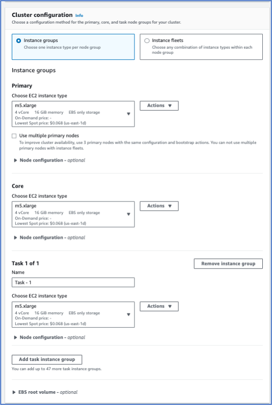

# Launch AWS EMR Cluster
## Objectives
- Launch an EMR (Elastic MapReduce) cluster to efficiently process and analyze large-scale datasets using distributed computing frameworks like Apache Hadoop and Apache Spark.
- Create an EMR cluster to support scalable data analytics, enabling the rapid processing of vast amounts of data.
## Presentation

## Lab Setup

|Time of performing|Required AWS services |
| :-: | :-: |
|20 minutes|VPC, EMR, S3, EC2, IAM|
## Steps
1. Create EC2 Key Pair	
1. ` `Navigate to EMR cluster.	
1. Create Cluster.	
1. Custom Cluster	
1. Cluster Configuration	
1. Cluster scaling manually	
1. Browse for VPC	
1. Browse for Subnet	
1. Manually terminate cluster	
1. Cluster Logs settings	
1. Ec2 Key Pair	10
1. Amazon EMR Service Role	
1. Create an instance profile	
1. Check out the whole cluster configuration
1. Cluster process of being created
## Step 1. Create EC2 Key Pair
- In the AWS Console navigate to the EC2 service.
- In the left panel, select the item titled **Key Pairs**.
- Select the item Create Key Pair.
- Give your key pair a name and choose .pem 
- Download it.

## Step 2. Navigate to EMR cluster.
## Step 3. Create Cluster.

## Step 4. Custom Cluster

For the section titled *Software Configuration* select the following options.

|**Option**|**Configuration**|
| :-: | :-: |
|Release|emr-6.11.0|
|Software|\*Hadoop, Hive, Tez, Pig, Spark, Livy and JupyterHub, JupyterEnterpriseGateway|
|Multi-master support|Leave as deafult|
|AWS Glue Data Catalog Settings|Select 1. Use for Hive table metadata, 2. Use for Spark table metadata|
|Amazon Linux Release|Leave as deafult|

## Step 5. Cluster Configuration 
Select the following options.

|**Option**|**Configuration**|
| :-: | :-: |
|Instance group configuration|Leave as default|
|Primary|Leave as default|
|Core|Leave as default|
|Task|Leave as default|

## Step 6. Cluster scaling manually

## Step 7. Browse for VPC 
And choose:

## Step 8. Browse for Subnet 
And choose:

## Step 9. Manually terminate cluster

## Step 10. Cluster Logs settings
Click on browse. Choose the bucket:

## Step 11. Ec2 Key Pair 
Choose the key pair that we previously created.

## Step 12. Amazon EMR Service Role

## Step 13. Create an instance profile

## Step 14. Check out the whole cluster configuration
In the right side check out the whole configuration. Finally, press on **Create cluster.**

## Step 15. Cluster process of being created. 

This can take a few minutes to complete. The cluster will be in waiting state once it completes.

## References
[Launch a cluster quickly](https://docs.aws.amazon.com/emr/latest/ManagementGuide/emr-launch-with-quick-options.html)

[Tutorial: Getting started with Amazon EMR](https://docs.aws.amazon.com/emr/latest/ManagementGuide/emr-gs.html)

[Best practices for cluster configuration](https://docs.aws.amazon.com/emr/latest/ManagementGuide/emr-plan-instances-guidelines.html)
