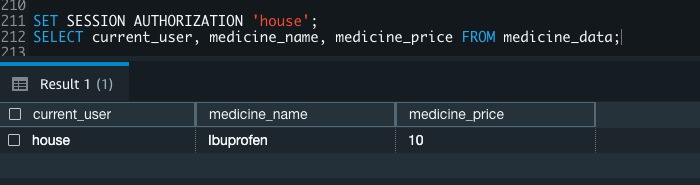

# <a name="_a9k7kceuydso"></a>Redshift Data Security: Row level and Column level security
## <a name="_liqm59wlqcss"></a>Objectives
- Implement row-level security in Redshift to restrict data access based on user privileges and roles.
- Integrate column-level security measures in Redshift to enforce fine-grained access controls on sensitive data attributes.
- Conduct thorough testing and auditing of the Redshift data security measures to ensure compliance and identify potential vulnerabilities.
## <a name="_r4lga3emmz5p"></a>Presentation


## <a name="_kbxuio8ez7bm"></a>Lab Setup


|Time of performing|Required AWS services |
| :-: | :-: |
|20 minutes|Redshift, S3|
## <a name="_shwckmyqvsac"></a>Steps
1. Row-level security
1. Create table
1. Load data into tabla
1. ` `Creating 'Customer' Table in 'Report' Schema and Loading Data from S3 to Redshift
1. RLS policies
1. Create roles
1. Column-level access control for the roles and columns that are implementing the RLS policy
1. Outputs of controls and rules
## <a name="_2anfy3cht5h8"></a>Step 1. Row-level security
Row-level security allows you to restrict some records to certain users or roles, depending on the content of those records. With RLS, you can define policies to enforce fine-grained row-level access control. When creating RLS policies, you can specify expressions that control whether Amazon Redshift returns any existing rows in a table in a query. With RLS policies limiting access, you don’t have to add or externalize additional conditions in your queries. You can attach multiple policies to a table, and a single policy can be attached to multiple tables
## <a name="_b64b6e988p3n"></a>Step 2. 
In the following example use cases, we illustrate enforcing an RLS policy on a fictitious healthcare setup. We demonstrate RLS on the medicine_data table and patients table, based on a policy established for managers, doctors, and departments. 

```sql
CREATE TABLE medicine_data (

`    `medicine_name      VARCHAR(200),

`    `medicine_price     INTEGER,

`    `confidential   BOOLEAN

);

drop table if exists employees cascade;

CREATE TABLE employees (

employee_username  VARCHAR(20),

employee_name      VARCHAR(100),

employee_is_doctor BOOLEAN

);

drop table if exists patients cascade;

CREATE TABLE patients (

patient_dept_id    INTEGER,

patient_name       VARCHAR(100),

patient_birthday   DATE,

patient_medicine       VARCHAR(200),

diagnosis          VARCHAR(200),

confidential       BOOLEAN

);

drop table if exists employees_departments cascade;

CREATE TABLE employees_departments (

employee_username   VARCHAR(20),

department_id       INTEGER 

);

## <a name="_hrmok84p3vzd"></a>Step 3. Load data into tables 
```

```sql
--2.    Load data into tables

INSERT INTO medicine_data

(medicine_name, medicine_price, confidential)

VALUES

('Ibuprofen', 10, false),

('Cabergolin', 50, true)

;

INSERT INTO employees

(employee_username, employee_name, employee_is_doctor)

VALUES

('house', 'Gregory House', true),

('wilson', 'James Wilson', true),

('cuddy', 'Lisa Cuddy', true),

('janitor', 'Glen Matthews', false),

('external', 'Some Guy', false)

;

INSERT INTO patients

(patient_dept_id, patient_name, patient_birthday, patient_medicine, diagnosis, confidential)

VALUES

(1, 'John Doe Minor', '2008-06-01', 'Ibuprofen', 'some diagnosis', false),

(1, 'Jane Doe Adult', '1992-06-01', 'Cabergolin', 'some other diagnosis', false),

(1, 'Lance Doe Confidential', '1992-06-01', 'Ibuprofen', 'another diagnosis', true),

(2, 'Boris Doe Dept 2', '1992-06-01', 'Cabergolin', 'new  diagnosis', false),

(2, 'Alice Doe Confidential', '1992-06-01', 'Ibuprofen', 'yet another diagnosis', true)

;

INSERT INTO employees_departments

(employee_username, department_id)

VALUES

('house', 1),

('wilson', 2),

('cuddy', 2),

('janitor', 3)

;
```

## <a name="_dqxgdwjq9rja"></a>Step 4. SQL Script for Creating 'Customer' Table in 'Report' Schema and Loading Data from S3 to Redshift

```

------------------------Table for session context variable -------------------------------------

drop schema if exists report cascade;

Create schema report; 

create table report.customer

(

c_customer_sk int4 not null , 

c_customer_id char(16) not null , 

c_current_cdemo_sk int4 , 

c_current_hdemo_sk int4 , 

c_current_addr_sk int4 , 

c_first_shipto_date_sk int4 , 

c_first_sales_date_sk int4 ,

c_salutation char(10) , 

c_first_name char(20) , 

c_last_name char(30) , 

c_preferred_cust_flag char(1) , 

c_birth_day int4 , 

c_birth_month int4 , 

c_birth_year int4 , 

c_birth_country varchar(20) , 

c_login char(13) , 

c_email_address char(50) , 

c_last_review_date_sk int4 ,

primary key (c_customer_sk)

) distkey(c_customer_sk);

copy report.customer from 's3://redshift-downloads/TPC-DS/2.13/3TB/customer/' iam_role default gzip delimiter '|' EMPTYASNULL region 'us-east-1';
```

## <a name="_s2c9iq9ayc7c"></a>Step 5. Define four RLS policies described using the secadmin role

1. all_can_see – No restrictions to be imposed
1. hide_confidential – Restricts records for non-confidential rows
1. only_doctors_can_see – Restricts records such that only doctors can see data
1. see_only_own_department – Restricts records to only see data for own department

```sql
CREATE RLS POLICY all_can_see

USING ( true );

CREATE RLS POLICY hide_confidential

WITH ( confidential BOOLEAN )

USING ( confidential = false )

;

CREATE RLS POLICY only_doctors_can_see

USING (

`    `true = (

`            `SELECT employee_is_doctor

`            `FROM employees

`            `WHERE employee_username = current_user

`            `)

`    `)

;
```


```

GRANT SELECT ON employees

TO RLS POLICY only_doctors_can_see;

CREATE RLS POLICY see_only_own_department

WITH ( patient_dept_id INTEGER )

USING (

`    `patient_dept_id IN (

`                        `SELECT department_id

`                        `FROM employees_departments

`                        `WHERE employee_username = current_user

`                        `)

`    `)

;

GRANT SELECT ON employees_departments 

TO RLS POLICY see_only_own_department;
```


## <a name="_xgfgq4b4arkz"></a>Step 6. Create three roles for STAFF, MANAGER, and EXTERNAL:
```sql
CREATE ROLE staff;

CREATE ROLE manager;

CREATE ROLE external;
```

## <a name="_mrntfs435gif"></a>Step 7. Define column-level access control for the roles and columns that are implementing the RLS policy

1. The MANAGER can access all columns in the Patients and Medicine_data tables, including the confidential column that defines RLS policies
```sql
--- manager can see full table patients and medicine data

GRANT SELECT ON employees, employees_departments, patients, medicine_data TO ROLE manager, ROLE external;
```


1. The STAFF role can access all columns except the confidential column:


--- staff can see limited columns from medicine data

```sql
GRANT SELECT (medicine_name, medicine_price) ON medicine_data 

TO ROLE staff;
```

--- staff can see, update limited columns & delete rows on patients table.

```sql
GRANT SELECT (patient_dept_id, patient_name, patient_birthday, patient_medicine, diagnosis) ON patients TO ROLE staff;

GRANT UPDATE (patient_dept_id, patient_name, patient_birthday, patient_medicine, diagnosis) ON patients TO ROLE staff;

GRANT DELETE ON patients TO ROLE staff;
```


1. Attach RLS policies to the roles we created:

--- manager can see all medicine data

```sql
ATTACH RLS POLICY all_can_see

ON medicine_data

TO ROLE manager;
```


--- manager can see all patient data

```sql
ATTACH RLS POLICY all_can_see

ON patients

TO ROLE manager;
```


--- staff cannot see confidential medicine data

```sql
ATTACH RLS POLICY hide_confidential

ON medicine_data

TO ROLE staff;
```


--- staff cannot see confidential patient data

```sql
ATTACH RLS POLICY hide_confidential

ON patients

TO ROLE staff;
```


--- only doctors can see patient data
```sql
ATTACH RLS POLICY only_doctors_can_see 

ON patients

TO PUBLIC;
```


--- regular staff (doctors) can see data for patients in their department only

```sql
ATTACH RLS POLICY see_only_own_department 

ON patients

TO ROLE staff;
```


1. Enable RLS security on objects:

```sql
ALTER TABLE medicine_data ROW LEVEL SECURITY on;

ALTER TABLE patients ROW LEVEL SECURITY on;
```


1. Create the users and grant them roles:
```sql

CREATE USER house PASSWORD DISABLE;

CREATE USER cuddy PASSWORD DISABLE;

CREATE USER external PASSWORD DISABLE;

GRANT ROLE staff TO house;

GRANT ROLE manager TO cuddy;

GRANT ROLE external TO external;
```

1. We can see RLS in action with a SELECT query:
```sql
--- As Cuddy, who is a doctor and a manager

SET SESSION AUTHORIZATION 'cuddy';

SELECT * FROM medicine_data;

--- policies applied: all_can_see
```

## <a name="_nk9zn434rt2j"></a>Step 8. Outputs
1. The output below shows the user 'cuddy' in a 'manager' role is authorized thorugh RLS POLICY 'all_can_see' can see all medicine data.


```sql
SELECT * FROM patients;
```


--- policies applied: all_can_see, only_doctors_can_see


1. The output below shows the user 'cuddy' in a 'manager' role is authorized thorugh RLS POLICY 'all_can_see' can see all patients data.


1. The permission denied for the user 'house' in a 'staff' role because it's not authorized to see all the columns inmedicine_data table, user is restricted by column level access control.


--- As House, who is a doctor but not a manager - he is staff in department id 1

SET SESSION AUTHORIZATION 'house';

SELECT * FROM medicine_data;

--- column level access control applied 


1. The output below shows the user 'house' in a 'staff' role is authorized to see only allowed columns through Column Level Access control and non-confidential data as RLS POLICY 'hide_confidential' restricts the confidential data.



SELECT current_user, medicine_name, medicine_price FROM medicine_data;

--- CLS + RLS policy = hide_confidential

1. The permission denied for the user 'house' in a 'staff' role because it's not authorized to see all the columns patients table, user is restricted by column level access control.


SELECT * FROM patients;

--- column level access control applied

1. There is no output below because the user 'external' in a 'external' role is not attached to any RLS POLICY for medicine_data table.
   

--- As External, who has no permission granted

SET SESSION AUTHORIZATION 'external';

SELECT * FROM medicine_data;

--- RLS policy applied: none - so no access

1. There is no results below because the user 'external' in a 'external' role is not attached to any RLS POLICY for patients table.


SELECT * FROM patients;

--- policies applied: none - so no access

1. Result shows the user 'house' was able to update the column it has access to for the two non-confidential records.


SET SESSION AUTHORIZATION 'house';

UPDATE patients

SET diagnosis = 'house updated diagnosis';


1. When user house queries the medicine_data table, no records should be returned, because the medicine_data table has RLS on and no RLS policy is attached to the role staff for this table.


SET SESSION AUTHORIZATION 'house';

SELECT * from MEDICINE_DATA;

Let’s turn off row-level security on the table medicine_data using the security admin role:

Now you can see below the user 'house' can access all the rows from MEDICINE_DATA with no RLS POLICY on the table MEDICINE_DATA.


SET SESSION AUTHORIZATION 'awsuser';

ALTER TABLE MEDICINE_DATA ROW LEVEL SECURITY OFF;

SET SESSION AUTHORIZATION 'house';

SELECT medicine_name, medicine_price from MEDICINE_DATA;
## <a name="_imnozvozfdwn"></a>References
[Amazon Redshift security overview](https://docs.aws.amazon.com/redshift/latest/dg/c_security-overview.html)

[Achieve fine-grained data security with row-level access control in Amazon Redshift](https://aws.amazon.com/blogs/big-data/achieve-fine-grained-data-security-with-row-level-access-control-in-amazon-redshift/)

[Row-level security](https://docs.aws.amazon.com/redshift/latest/dg/t_rls.html)


