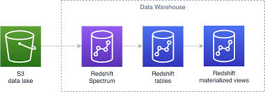

# <a name="_a9k7kceuydso"></a>Redshift Spectrum: Analyzing Data Directly from Amazon S3 Storage
## <a name="_liqm59wlqcss"></a>Objectives
- Redshift Spectrum enables cost-effective data analysis by querying data in Amazon S3 directly, minimizing storage and operational costs.
- Unified Data Access: It seamlessly integrates with Amazon Redshift, providing a unified view of data from various sources in S3, simplifying data access and analysis across the entire data lake.
- Scalable Performance: Leveraging parallel processing, Redshift Spectrum delivers enhanced query performance and scalability, empowering organizations to process large-scale datasets.
## <a name="_r4lga3emmz5p"></a>Presentation


## <a name="_kbxuio8ez7bm"></a>Lab Setup


|Time of performing|Required AWS services |
| :-: | :-: |
|20 minutes|Redshift, S3, Query Editor v2, IAM|
## <a name="_shwckmyqvsac"></a>Steps
1. Create a bucket
1. Store a dataset
1. Create a cluster on Redshift
1. Create a notebook on Query Editor v2
1. Create the scheme, table, and validate data.
## <a name="_b64b6e988p3n"></a>Step 1. 


## <a name="_5m3m3tda2sst"></a>Step 2. 


## <a name="_u6pspqn472el"></a>Step 3.
## 
## <a name="_echb5q4vp7o0"></a><a name="_o5zj5b92c29v"></a>Step 4. 


## <a name="_i14cynz5lqas"></a>Step 5.
### <a name="_6h8ywbd8ikx2"></a>Schema


```sql
CREATE EXTERNAL SCHEMA spectrum_schema

FROM DATA CATALOG

DATABASE 'spectrum_db'

IAM_ROLE 'arn:aws:iam::043479757401:role/service-role/AmazonRedshift-CommandsAccessRole-20230728T074328'

CREATE EXTERNAL DATABASE IF NOT EXISTS;
```


### <a name="_4mmpquaz1ceu"></a>Table


```sql
drop table spectrum_schema.saas_sales;

CREATE EXTERNAL TABLE spectrum_schema.saas_sales (

"Row ID" INTEGER,

"Order ID" VARCHAR(150),

"Order Date" DATE,

"Date Key" INTEGER,

"Contact Name" VARCHAR(100),

"Country" VARCHAR(50),

"City" VARCHAR(50),

"Region" VARCHAR(50),

"Subregion" VARCHAR(50),

"Customer" VARCHAR(100),

"Customer ID" INTEGER,

"Industry" VARCHAR(100),

"Segment" VARCHAR(100),

"Product" VARCHAR(100),

"License" VARCHAR(50),

"Sales" DECIMAL(10, 2),

"Quantity" INTEGER,

"Discount" DECIMAL(5, 2)

)

ROW FORMAT DELIMITED

FIELDS TERMINATED BY ','

LOCATION 's3://source-data-demo/new-prefix';
```


### <a name="_za9s2qluq7gt"></a>Bring data and validation


```sql
SELECT *

FROM spectrum_schema.saas_sales
```


## <a name="_imnozvozfdwn"></a>References
[Getting started with Amazon Redshift Spectrum](https://docs.aws.amazon.com/redshift/latest/dg/c-getting-started-using-spectrum.html)

[Querying external data using Amazon Redshift Spectrum](https://docs.aws.amazon.com/redshift/latest/dg/c-using-spectrum.html)

[Amazon Redshift vs Redshift Spectrum: 6 Comprehensive Differences](https://hevodata.com/learn/amazon-redshift-vs-redshift-spectrum/)


