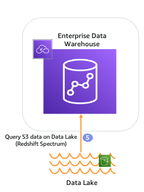
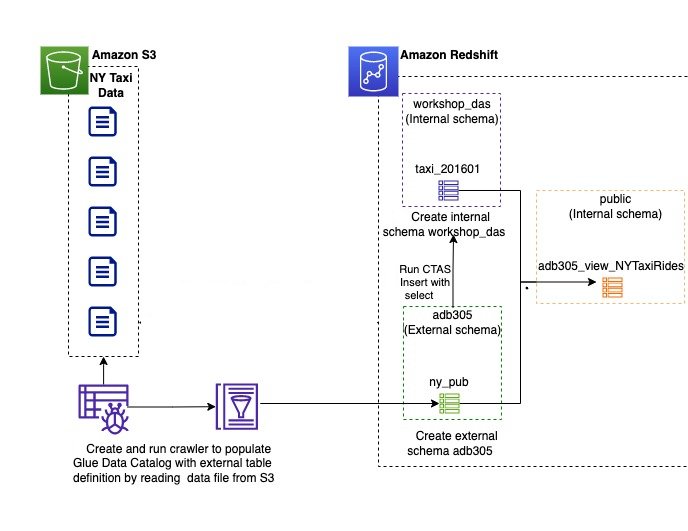
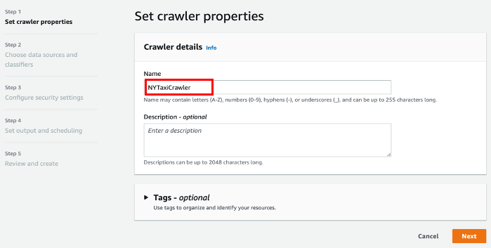
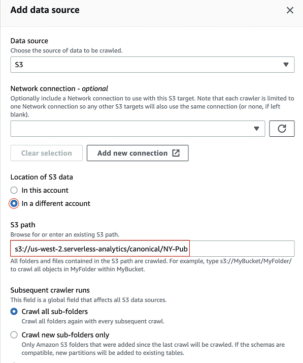
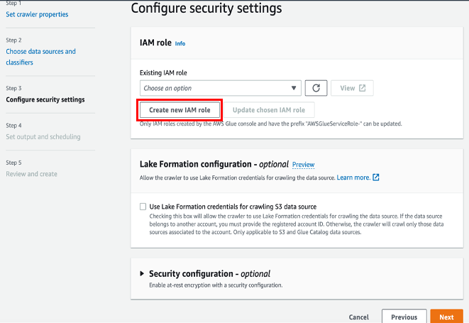
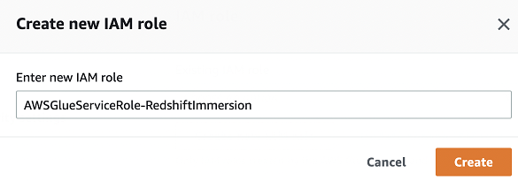
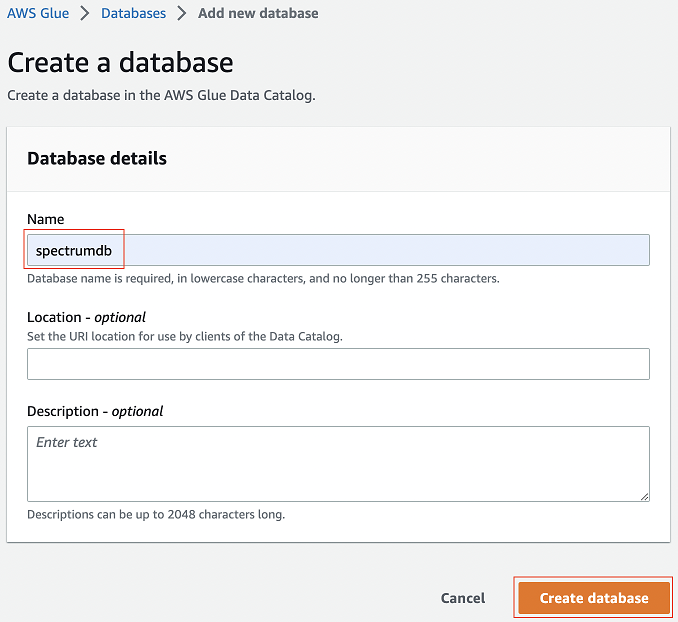
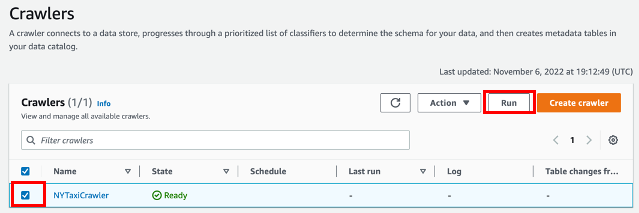
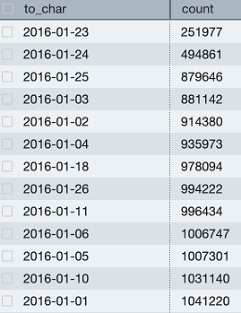

# <a name="_a9k7kceuydso"></a>Redshift Spectrum: Querying Data Lake
## <a name="_liqm59wlqcss"></a>Objectives
- Query Amazon S3 Data Lake: Learn how to perform queries on data stored in a Amazon S3 data lake using Amazon Redshift without the need to load or move the data.
- Utilize Union Views: Understand how to create and use views that combine data from Redshift Managed storage with data stored in Amazon S3.
- Query Structured and Semi-Structured Data: Discover how to run queries on both structured and semi-structured data directly from files stored in Amazon S3.
## <a name="_r4lga3emmz5p"></a>Presentation



## <a name="_kbxuio8ez7bm"></a>Lab Setup


|Time of performing|Required AWS services |
| :-: | :-: |
|30 minutes|Redshift spectrum, S3, IAM, Glue, Query Editor v2|
## <a name="_shwckmyqvsac"></a>Steps
1. Use-Case Description
1. Create and run Glue crawler to populate Glue data catalog and Create external schema for redshift spectrum
1. Create external schema in Redshift and select from Glue catalog table
## <a name="_b64b6e988p3n"></a>Step 1. 

**[Data Set](https://s3.console.aws.amazon.com/s3/buckets/us-west-2.serverless-analytics?prefix=canonical%2FNY-Pub%2F&region=us-west-2) Description**: New York city taxi trip data including number of taxi rides for 3 different taxi companies fhv, green, and yellow.




## <a name="_jr52rjwaa0hk"></a>Step 2. 
### <a name="_ypt18k1oz35"></a>Create and run Glue crawler to populate Glue data catalog and Create external schema (and DB) for Redshift Spectrum

In this lab, you will use AWS Glue Crawler to create external table adb305.ny_pub stored in parquet format under location s3://us-west-2.serverless-analytics/canonical/NY-Pub/.

**Glue crawler Page**


**Click on Create Crawler**



**Click on Add a data source.**


**Choose S3 as the data store, select In a different account and enter S3 file path s3://redshift-demos/data/NY-Pub for us-east-1  and s3://us-west-2.serverless-analytics/canonical/NY-Pub. Click on Add an S3 data source.**



**Select the S3 as data source for crawler and click Next**


**Click Create new IAM role and click Next**






**Click on Add database and enter Name spectrumdb, press on create, and  all remaining defaults.**




**Click Run crawler**



**After Crawler run completes, you can see a new table ny_pub in Glue Catalog**


## <a name="_va1f9s3mze7w"></a>Step 3.
### <a name="_qwok0e64995d"></a>Create external schema adb305 in Redshift and select from Glue catalog table - ny_pub

**Go to Redshift console.**


**Create an external schema adb305 pointing to your Glue Catalog Database spectrumdb.**
```sql
CREATE external SCHEMA adb305

FROM data catalog DATABASE 'spectrumdb'

IAM_ROLE default

CREATE external DATABASE if not exists;
```

**You can query the table ny_pub**

```sql
SELECT TO_CHAR(pickup_datetime, 'YYYY-MM-DD'),COUNT(*)

FROM adb305.ny_pub

WHERE YEAR = 2016 and Month = 01

GROUP BY 1

ORDER BY 2;
```



## <a name="_imnozvozfdwn"></a>References
[AWS Lake Formation - Step 12: Query the data in the data lake using Amazon Redshift Spectrum](https://docs.aws.amazon.com/lake-formation/latest/dg/tut-query-redshift.html)
[Using Redshift Spectrum with AWS Lake Formation](https://docs.aws.amazon.com/redshift/latest/dg/spectrum-lake-formation.html)

[How to Use AWS Redshift Spectrum in AWS Lake Formation](https://ahana.io/answers/using-amazon-redshift-aws-lake-formation/)


