# Set up AwS Redshift Cluster and Load Data

## Objectives

-   Set up a Redshift cluster on AWS with the desired configuration, including choosing the appropriate instance types, number of nodes, and network settings. Ensure that the cluster is properly configured to meet the testing requirements.

-   Verify and test the functionality of the Query Editor provided by Amazon Redshift. Test various SQL queries and statements to validate that the editor works as expected, allowing for querying and analyzing the loaded test data.

-   Load test data into the Redshift cluster from various sources such as S3, RDS, or other databases. Use the COPY command or any other suitable method to efficiently load the data, ensuring data integrity and correctness.

## Presentation

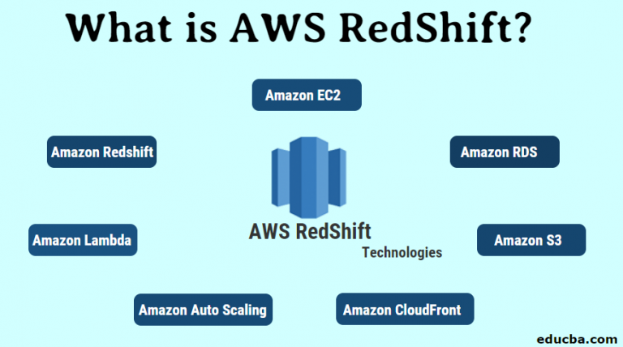

Frequently, we encounter a common question regarding the pre-existing location of the data warehouse and data processing before adopting AWS Tool. 

Initially, we relied on physical servers and databases to manage data and its processing, which worked fine for modest data loads. However, as data size exponentially grew, queries and data handling became challenging, resulting in **lengthy query execution times**.


To address this issue, Amazon Redshift emerged as a solution. It offered significantly **faster performance, high scalability, and efficient data storage and processing capabilities**. With its vast storage capacity and
transparent pricing, Amazon Redshift proved to be a valuable solution for handling and manufacturing data effectively.

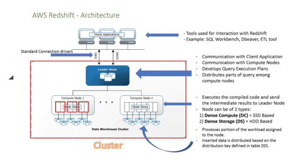

**Advantages**

-   High Speed

-   Bulk Data Processing

-   Minimal Data Loss

-   Cost-Effective

-   SQL Interface

-   Security

## Lab Setup

<center>
<div style="text-align: center;">

Time of performing | Required AWS services
--------------------|-----------------------
   20 minutes      |     Redshift, Query Editor
</div>
</center>

## Steps

1.  Create the cluster on Redshift

2.  Verification of the environment

3.  Data loading and Query Editor

4.  Clean and free up all resources used so far

## Step 1 - Create the cluster on Redshift
In the box search, type Redshift. 
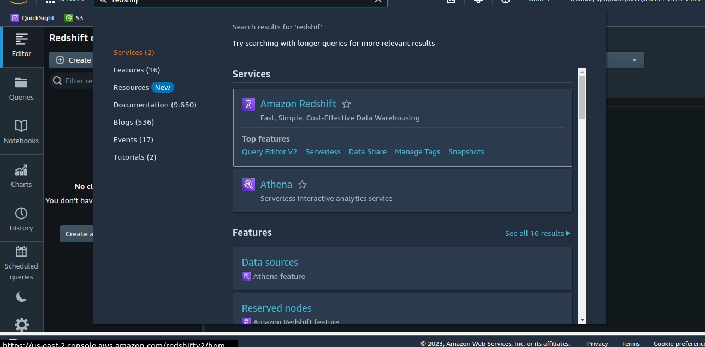

Once getting in, click on **Create cluster**
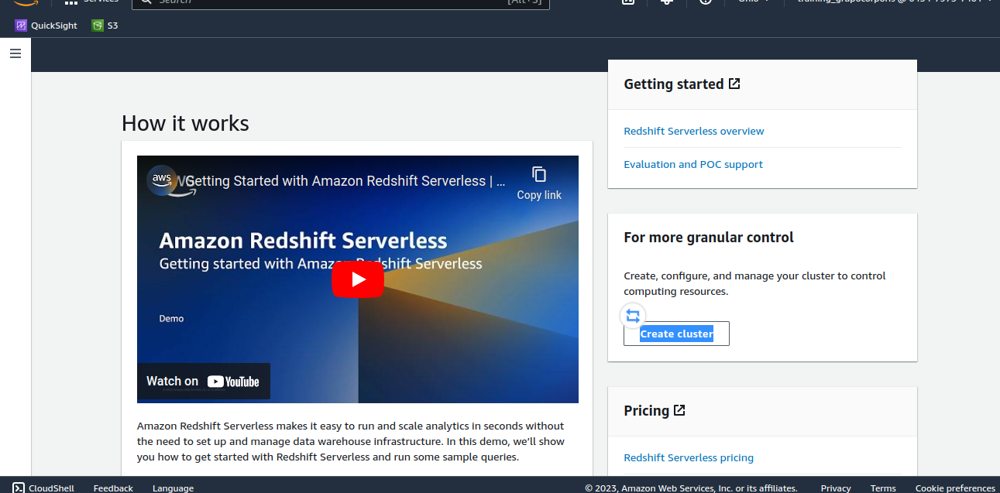

Fill up with a proper name. Select **I'll choose** for setting up the **Node type**. It means how many **vcpus** and how much **Ram** you will use for querying and processing.

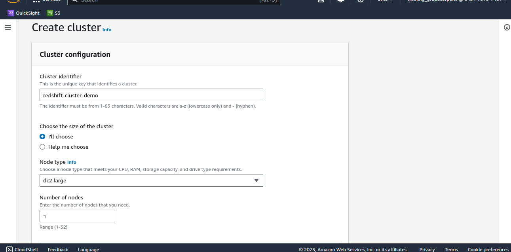

Below, on data configuration, we can custom the database credentials to login later.

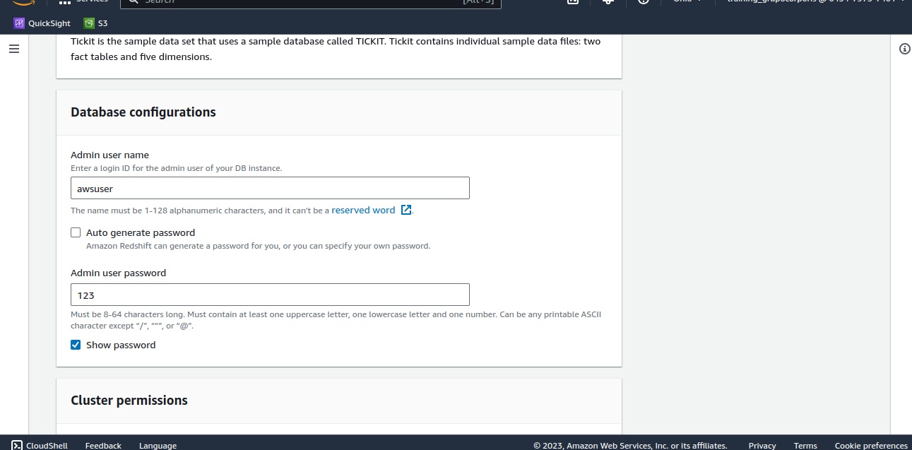

Finally, let us the rest of setting by default. And, **Create cluster**


## Step 2 - Verification of the environment

Once created the cluster and we wait some minutes for getting up the service up to it gets ready.

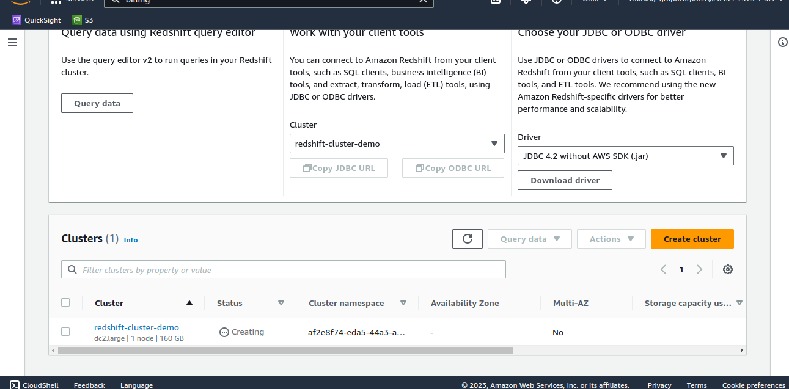

Once verifying the **availability** of the service, let's pay atention at **Endpoint**, which contains the **cluster's name**, **region**, and **db's port and name**.

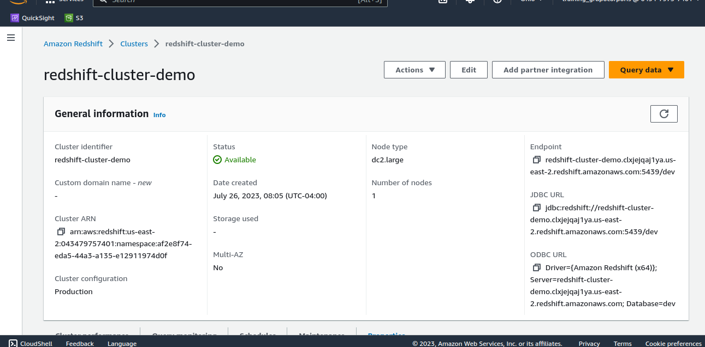

We can below explore cluster's options. Click on **Properties** tab and verify your settings done according to the new cluster lunched.

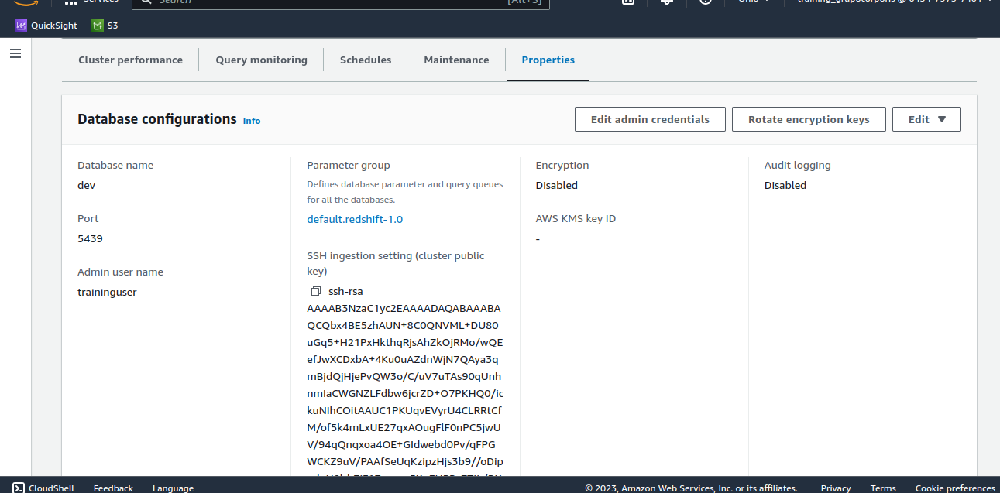

## Step 3 - Data loading and Query Editor

Let's point out on **Query data**, click it, and choose the first option.

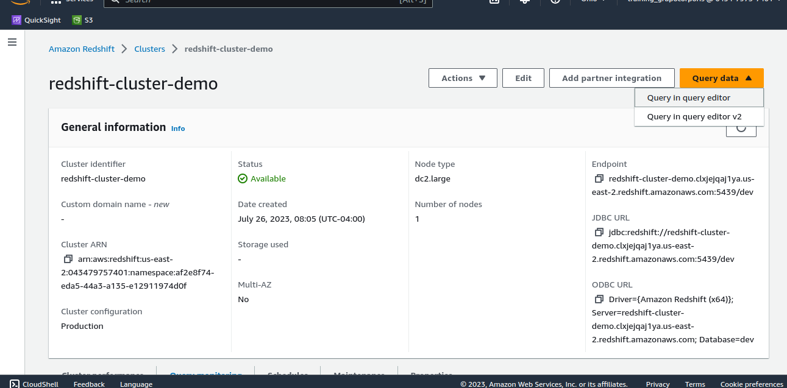

Now we **connect to the database**. 

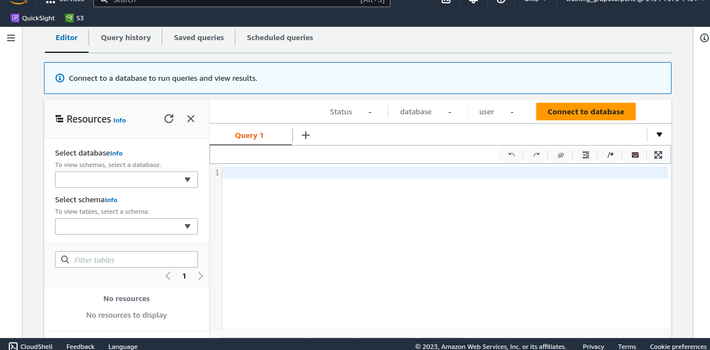

At the end of the previous step, we can see the credentials for DB. Fill up the boxes accordingly.

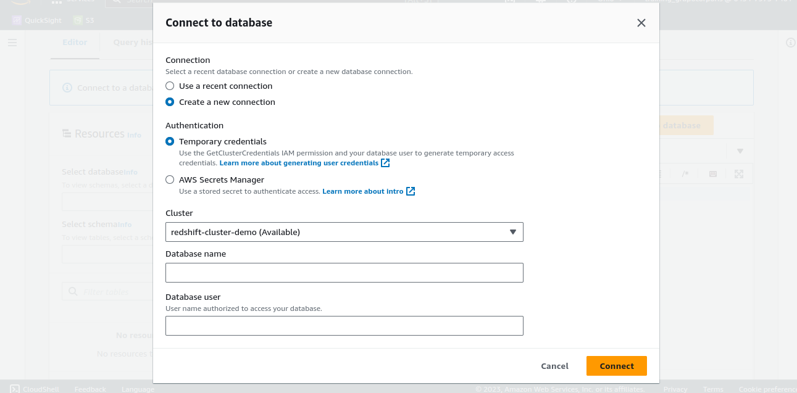

After that, Query editor will be enable to introduce SQL queries. Write and test it by pasting this code.

```sql
-- Create the table 'employees'
CREATE TABLE employees (
    id INT,
    name VARCHAR(50),
    department VARCHAR(50),
    age INT
);

-- Inserting records into the 'employees' table
INSERT INTO employees (id, name, department, age) VALUES
(1, 'John Doe', 'HR', 30),
(2, 'Jane Smith', 'Engineering', 35),
(3, 'Michael Johnson', 'Finance', 28),
(4, 'Sarah Lee', 'Marketing', 27),
(5, 'Robert Brown', 'Operations', 32);
```
Create a table into Redshift, then click on **Run** button.

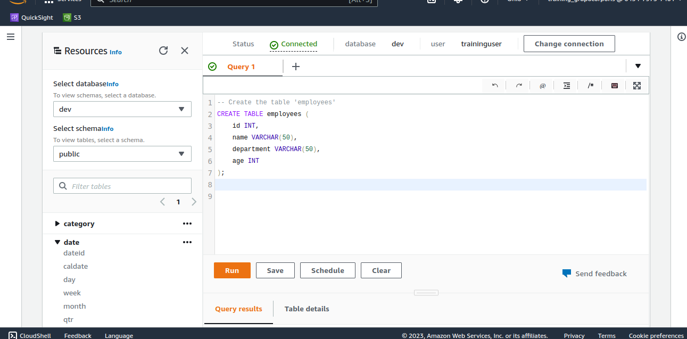

In the following, we introduce its valuest to the created table, and **Run**.

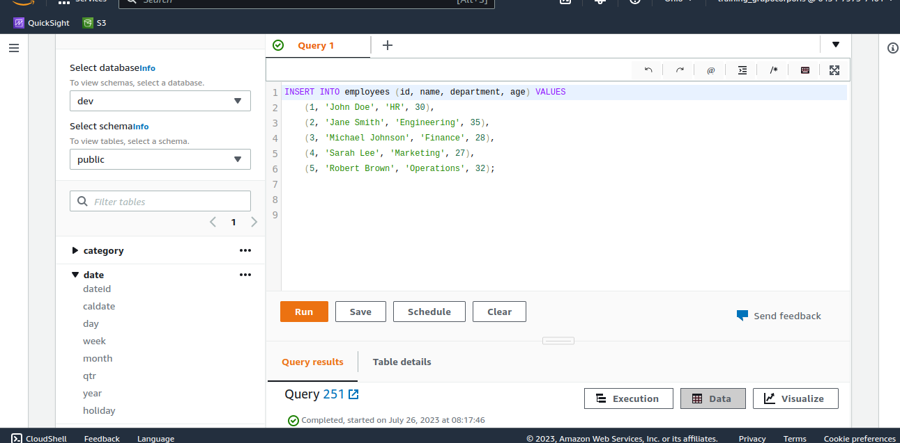

Finally, verify all data introduced.

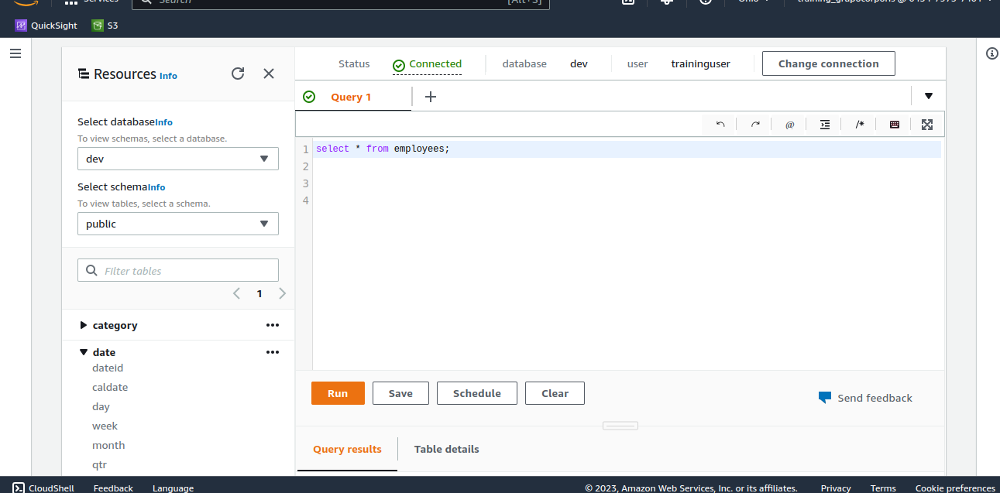

Press **Run**.

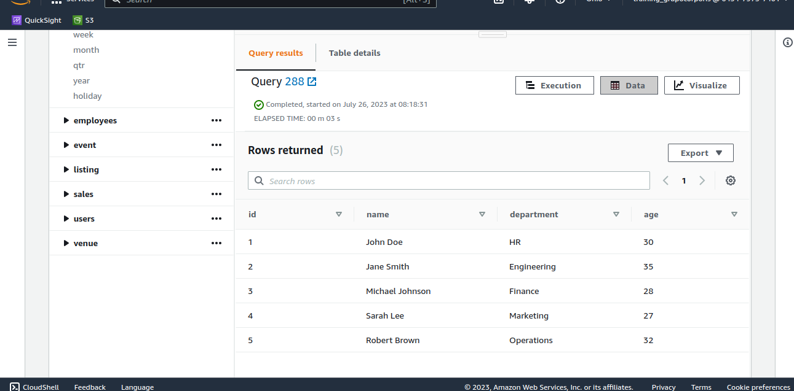

## Step 4: Clean and free up all resources used so far

## References

[Creating a Redshift Cluster](https://docs.aws.amazon.com/redshift/latest/dg/tutorial-loading-data-create-cluster.html)

[Amazon Redshift Query Editor](https://docs.aws.amazon.com/redshift/latest/dg/c_query_editor.html)

[Amazon Redshift Developer Guide](https://docs.aws.amazon.com/redshift/latest/dg/welcome.html)
