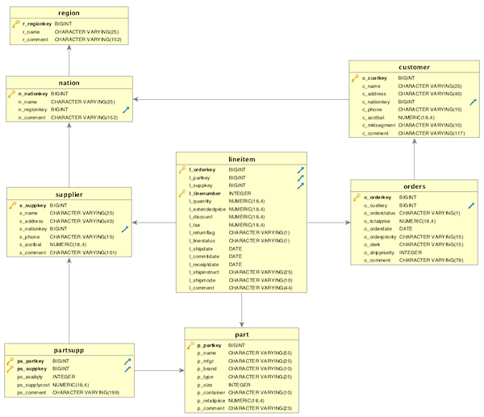

# <a name="_a9k7kceuydso"></a>Redshift: Table Design and Load from S3 Data Laking
## <a name="_liqm59wlqcss"></a>Objectives
- Understanding Table Design in Redshift: Provide a comprehensive overview of table design principles in Amazon Redshift.
- Exploring Data Lake Integration and loading: Explain the concept of [data lake integration](https://s3.console.aws.amazon.com/s3/buckets/redshift-immersionday-labs?region=us-west-2&prefix=data/&showversions=false) with Redshift, ensuring fast and reliable loading performance.
- Data Validation & Quality: Implement robust data validation and quality checks during the loading process.
- Gain the ability to troubleshoot common loading errors.
- Understand automatic maintenance tasks
## <a name="_kbxuio8ez7bm"></a>Lab Setup


|Time of performing|Required AWS services |
| :-: | :-: |
|40 minutes|Redshift, Query Editor V2, IAM roles|
## <a name="_shwckmyqvsac"></a>Steps
1. Create tables
1. Data Loading
1. Data Loading from S3
1. Load Validation
1. Troubleshooting of loading data
1. Automatic Table Maintenance
1. Pause Cluster

## <a name="_b64b6e988p3n"></a>Step 1. Create tables


```sql

DROP TABLE IF EXISTS partsupp;
DROP TABLE IF EXISTS lineitem;
DROP TABLE IF EXISTS supplier;
DROP TABLE IF EXISTS part;
DROP TABLE IF EXISTS orders;
DROP TABLE IF EXISTS customer;
DROP TABLE IF EXISTS nation;
DROP TABLE IF EXISTS region;

CREATE TABLE region (

R_REGIONKEY bigint NOT NULL,

R_NAME varchar(25),

R_COMMENT varchar(152))

diststyle all;

CREATE TABLE nation (

N_NATIONKEY bigint NOT NULL,

N_NAME varchar(25),

N_REGIONKEY bigint,

N_COMMENT varchar(152))

diststyle all;

create table customer (

C_CUSTKEY bigint NOT NULL,

C_NAME varchar(25),

C_ADDRESS varchar(40),

C_NATIONKEY bigint,

C_PHONE varchar(15),

C_ACCTBAL decimal(18,4),

C_MKTSEGMENT varchar(10),

C_COMMENT varchar(117))

diststyle all;

create table orders (

O_ORDERKEY bigint NOT NULL,

O_CUSTKEY bigint,

O_ORDERSTATUS varchar(1),

O_TOTALPRICE decimal(18,4),

O_ORDERDATE Date,

O_ORDERPRIORITY varchar(15),

O_CLERK varchar(15),

O_SHIPPRIORITY Integer,

O_COMMENT varchar(79))

distkey (O_ORDERKEY)

sortkey (O_ORDERDATE);

create table part (

P_PARTKEY bigint NOT NULL,

P_NAME varchar(55),

P_MFGR varchar(25),

P_BRAND varchar(10),

P_TYPE varchar(25),

P_SIZE integer,

P_CONTAINER varchar(10),

P_RETAILPRICE decimal(18,4),

P_COMMENT varchar(23))

diststyle all;

create table supplier (

S_SUPPKEY bigint NOT NULL,

S_NAME varchar(25),

S_ADDRESS varchar(40),

S_NATIONKEY bigint,

S_PHONE varchar(15),

S_ACCTBAL decimal(18,4),

S_COMMENT varchar(101))

diststyle all;

create table lineitem (

L_ORDERKEY bigint NOT NULL,

L_PARTKEY bigint,

L_SUPPKEY bigint,

L_LINENUMBER integer NOT NULL,

L_QUANTITY decimal(18,4),

L_EXTENDEDPRICE decimal(18,4),

L_DISCOUNT decimal(18,4),

L_TAX decimal(18,4),

L_RETURNFLAG varchar(1),

L_LINESTATUS varchar(1),

L_SHIPDATE date,

L_COMMITDATE date,

L_RECEIPTDATE date,

L_SHIPINSTRUCT varchar(25),

L_SHIPMODE varchar(10),

L_COMMENT varchar(44))

distkey (L_ORDERKEY)

sortkey (L_RECEIPTDATE);

create table partsupp (

PS_PARTKEY bigint NOT NULL,

PS_SUPPKEY bigint NOT NULL,

PS_AVAILQTY integer,

PS_SUPPLYCOST decimal(18,4),

PS_COMMENT varchar(199))

diststyle even;

```

## <a name="_cremkn50gnpj"></a>Step 2. Data Loading
In this lab, you will learn following approaches to load data into Redshift.

1. Load data from S3 to Redshift. You will use this process for loading 7 tables out of 8 tables created in above step.
1. Load data from your desktop file to Redshift. You will use this process for loading 1 table out of 8 created in above step i.e. nation table.
## <a name="_1nr5h0az3953"></a>Step 3. Data Loading from S3
COPY command  loads large amounts of data effectively from Amazon S3 into Amazon Redshift. A single COPY command can load from multiple files into one table. It automatically loads the data in parallel from all the files present in the S3 location you provide.


```sql

COPY region FROM 's3://redshift-immersionday-labs/data/region/region.tbl.lzo'

IAM_ROLE 'arn:aws:iam::043479757401:role/service-role/AmazonRedshift-CommandsAccessRole-20230728T074328'

REGION 'us-west-2' LZOP DELIMITER '|' COMPUPDATE PRESET;

COPY customer FROM 's3://redshift-immersionday-labs/data/customer/customer.tbl.'

IAM_ROLE 'arn:aws:iam::043479757401:role/service-role/AmazonRedshift-CommandsAccessRole-20230728T074328'

REGION 'us-west-2' LZOP DELIMITER '|' COMPUPDATE PRESET;

COPY orders FROM 's3://redshift-immersionday-labs/data/orders/orders.tbl.'

IAM_ROLE 'arn:aws:iam::043479757401:role/service-role/AmazonRedshift-CommandsAccessRole-20230728T074328'

REGION 'us-west-2' LZOP DELIMITER '|' COMPUPDATE PRESET;

COPY part FROM 's3://redshift-immersionday-labs/data/part/part.tbl.'

IAM_ROLE 'arn:aws:iam::043479757401:role/service-role/AmazonRedshift-CommandsAccessRole-20230728T074328'

REGION 'us-west-2' LZOP DELIMITER '|' COMPUPDATE PRESET;

COPY supplier FROM 's3://redshift-immersionday-labs/data/supplier/supplier.json' MANIFEST

IAM_ROLE 'arn:aws:iam::043479757401:role/service-role/AmazonRedshift-CommandsAccessRole-20230728T074328'

REGION 'us-west-2' LZOP DELIMITER '|' COMPUPDATE PRESET;

COPY lineitem FROM 's3://redshift-immersionday-labs/data/lineitem-part/'

IAM_ROLE 'arn:aws:iam::043479757401:role/service-role/AmazonRedshift-CommandsAccessRole-20230728T074328'

REGION 'us-west-2' GZIP DELIMITER '|' COMPUPDATE PRESET;

COPY partsupp FROM 's3://redshift-immersionday-labs/data/partsupp/partsupp.tbl.'

IAM_ROLE 'arn:aws:iam::043479757401:role/service-role/AmazonRedshift-CommandsAccessRole-20230728T074328'

REGION 'us-west-2' LZOP DELIMITER '|' COMPUPDATE PRESET;


```


REGION (5 rows) - 2s

CUSTOMER (15M rows) – 2m

ORDERS - (76M rows) - 10s

PART - (20M rows) - 2m

SUPPLIER - (1M rows) - 10s

LINEITEM - (303M rows) - 22s

PARTSUPPLIER - (80M rows) - 15s

**region.tbl.lzo**: This file has the extension ".lzo" and is likely compressed using the LZO compression format. LZO (Lempel-Ziv-Oberhumer) is a data compression algorithm that is commonly used for fast data loading and processing in Amazon Redshift.

**partsupp.tbl**: It's important to note that file extensions do not necessarily determine the format of the data inside the files; they are just a way to provide hints about the file's content of tabular data.
## <a name="_ifgni8vn6fmv"></a>Step 4. Load Validation
Let us do a quick check of counts on few tables to ensure data.

```sql

` `--Number of rows= 5

select count(*) from region;

` `--Number of rows= 25

select count(*) from nation;

` `--Number of rows= 76,000,000

select count(*) from orders;

```


## <a name="_dnnej38dnks7"></a>Step 5. Troubleshooting of loading data
To troubleshoot any data load issues, you can query SYS_LOAD_ERROR_DETAIL.

Let’s try to load the CUSTOMER table with a different data file with mismatched columns.

```sql

COPY customer FROM 's3://redshift-immersionday-labs/data/nation/nation.tbl.'

iam_role default

region 'us-west-2' lzop delimiter '|' noload;

```

You will get the following error:

```

ERROR: Load into table 'customer' failed. Check 'sys_load_error_detail' system table for details.

```

` `Query the STL_LOAD_ERROR system table for details.

```sql
select * from SYS_LOAD_ERROR_DETAIL;
```


## <a name="_8uvcomd8cbfg"></a>Step 6. Automatic Table Maintenance
When loading into an empty table, the COPY command by default collects statistics (ANALYZE). If you are loading a non-empty table using COPY command, in most cases, you don't need to explicitly run the ANALYZE command. 

Amazon Redshift monitors changes to your workload and automatically updates statistics in the background. To minimize impact to your system performance, automatic analyze runs during periods when workloads are light.

If you need to analyze the table immediately after load, run ANALYZE on orders table.

```sql

ANALYZE orders;

```


## <a name="_lll1qjz9fw8"></a>Step 7. Pause cluster

## <a name="_imnozvozfdwn"></a>References
[Validating input data](https://docs.aws.amazon.com/redshift/latest/dg/t_Validating_input_files.html)

[Troubleshooting queries](https://docs.aws.amazon.com/redshift/latest/dg/queries-troubleshooting.html)

[6 Redshift features that change the data warehouse game](https://www.stitchdata.com/resources/redshift/)
