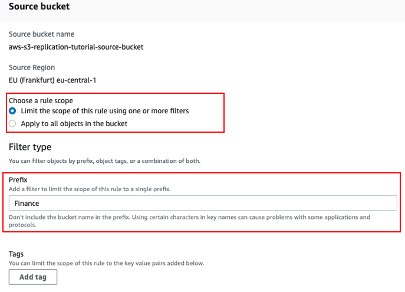
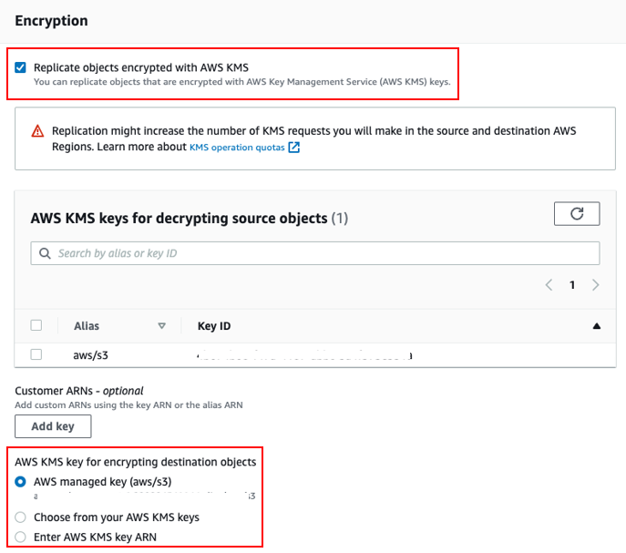
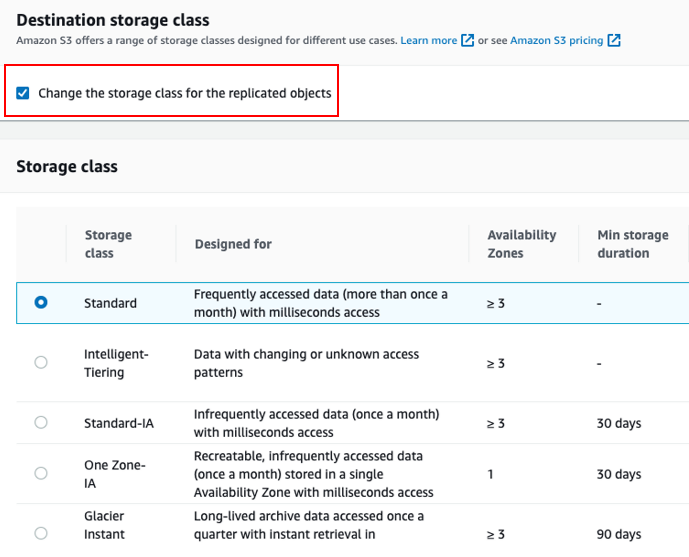
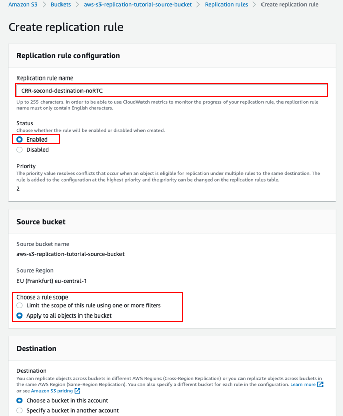
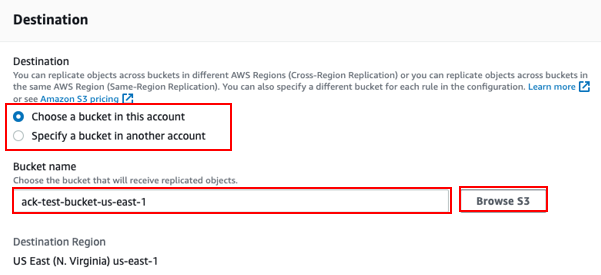
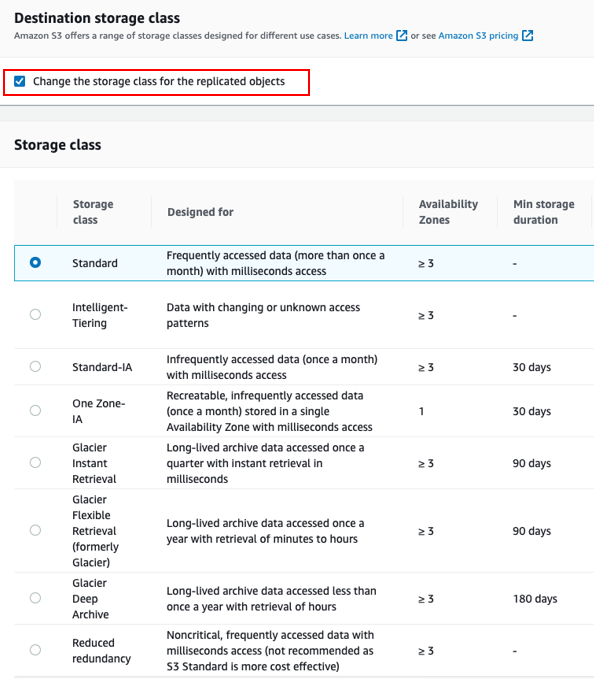
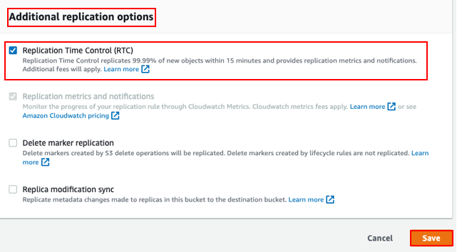
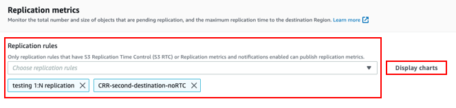

# Replicate Data within and between AWS Regions Using Amazon S3 Replication

## Objetivos

- Create an S3 bucket
- Create an S3 Replication rule on your S3 bucket
- Choose destination S3 bucket
- Choose or create IAM roles for replication
- Specify encryption type (optional)
- Choose destination S3 storage class
- Enable additional replication options (optional)

|Tiempo de realización|Servicios utilizados|
| :-: | :-: |
|40 minutos|Amazon S3, Amazon CloudWatch, IAM|
|Requisitos previos|Glacier, intelligent-tiering, deep archive|

### Step 1: Create an Amazon S3 bucket
**1.1 — Sign in to the Amazon S3 console** 

From the AWS console services search bar, enter S3. Under the services search results section, select S3.

1\.2 — Create an S3 bucket 

1\.3

1\.4

Make sure to enable Bucket Versioning for the destination S3 bucket as well. 

### Step 2: Create an S3 Replication on your S3 bucket

2\.1 – Select source S3 bucket

2\.2 

2\.3 – Create an S3 Replication rule for the selected S3 bucket

- Choose the Management tab of the replication source bucket. 
- Under Management, you will see Replication rules. 
- Select Create replication rule.

### Step 3: Configure a replication rule

3\.1 – Enable replication rule

Provide a Replication rule name and enable the replication rule by selecting Enabled under the Status section. If the replication rule is disabled, it will not run.

The priority of replication rules determines which rule has precedence when two or more replication rules conflict. The rule with the highest priority is executed first.

3\.2 – Choose what to replicate

Narrow the scope of replication by defining a Filter type (Prefix or Tags), or choose to replicate the entire bucket. For example, if you want to only replicate objects that are in the Prefix “Finance”, specify that scope. 

3\.3 – Choose destination S3 bucket

Choose the destination bucket by selecting the Browse S3 button. You can replicate to a destination bucket in the same or different AWS Region, and in the same or different AWS account. Note that you will need two different S3 buckets to configure replication, and both buckets (source and destination) must have S3 Versioning enabled. The S3 console does not provide you with a way to create a new S3 bucket in the replication setup process. In this example, we chose the destination bucket to be “aws-s3-replication-tutorial-destination-bucket.”

3\.4 - IAM considerations

When creating new replication rules from the same source bucket, make sure that the IAM role associated with this configuration has sufficient permissions to write new objects in the new destination bucket. You can choose to create a new IAM role or select an existing IAM role with the right set of permissions.

3\.5 - Encryption options (Skip this step if your objects are not encrypted)

If your objects are encrypted with Amazon S3-managed encryption keys (SSE-S3) or AWS Key Management Service (AWS KMS), you will need to specify the encryption options while setting up replication. S3 Replication supports SSE-S3 (default encryption) and AWS KMS server-side encryption

3\.6 - Select the S3 storage class for your destination

Next, you will have the option to choose a different S3 storage class for your replicated objects at the destination bucket. Consider choosing lower cost storage classes as appropriate for your workloads. For example, you can choose the S3 Glacier Instant Retrieval storage class if your replicated objects will be infrequently accessed but need to be retrieved in milliseconds, S3 Glacier Deep Archive to archive data that rarely needs to be accessed, and S3 Intelligent-Tiering to optimize storage costs for data with unpredictable or changing access patterns. 

3\.7 – Additional replication options

- Choose Additional replication options, such as enabling S3 Replication Time Control (S3 RTC), Replication metrics and notifications, Delete marker replication, and Replica modifications sync. S3 RTC helps you meet compliance and business requirements as it provides an SLA of 15 minutes to replicate 99.99% of your objects. RTC can be enabled along with S3 Cross-Region Replication (S3 CRR) and S3 Same-Region Replication (S3 SRR) and has replication metrics and notifications enabled, by default. 
- For non-RTC rules, you have the option to select Replication metrics and notifications, which provide detailed metrics to track minute-by-minute progress of bytes pending, operations pending, and replication latency for the replication rule. 
- Selecting Delete marker replication means deletes on the source bucket will be replicated to the destination bucket. This should be enabled if you want to keep the source and destination buckets in sync, but not if the goal is to protect against accidental or malicious deletes. 
- To establish two-way replication between two S3 buckets, create bidirectional replication rules (A to B, and B to A) and enable Replica modification sync for both of the replication rules in the source and destination S3 buckets. This will help you to keep object metadata such as tags, ACLs, and Object Lock settings in sync between replicas and source objects.

### Step 4: Create another S3 Replication rule on the same source S3 bucket to another destination S3 bucket

- Repeat the previous steps to create another S3 Replication rule from the same source S3 bucket to another destination S3 bucket. Provide a Replication rule name and enable the replication rule by selecting Enabled under the Status section. Choose what to replicate by choosing the scope of the replication rule.

- Choose the destination bucket by selecting the Browse S3 button. In this example, we chose the destination bucket to be “ack-test-bucket-us-east-1”.

- Select the Destination S3 storage class. In this example, we chose to replicate to the S3 Standard storage class in the destination bucket.

- Choose Additional replication options for the replication rule. In this example, we chose to enable S3 Replication Time Control (RTC).

### **Step 5: Review replication configuration**

Once you save the replication rule, you are back on the S3 Replication landing page, as shown in the following screenshot. Here, you can review the replication configuration with all the different replication rules, and the rule priorities and the additional options, such as encryption and RTC. 

Next, upload a new object to the replication source bucket to test the newly added replication configuration. Confirm that you see that object replicated to the new destination bucket. Replication metrics can take a few minutes to show up in the S3 console.

### Step 6: Monitor replication progress

6\.1 

Now that you've configured replication for this bucket, you can track per-destination metrics and notifications. Open the Metrics tab for the source bucket.

6\.2 

- Navigate down to view Replication metrics and select one or more Replication rules to monitor. 
- Choose Display charts to see Operations pending replication, Bytes pending replication, and Replication latency for all replication rules.

6\.3

- Additionally, you can use the View in CloudWatch link to view the Replication metrics on Amazon CloudWatch. 
- Here you can get a comprehensive view of the replication metrics for each replication rule, source bucket, and destination bucket in one place. Additionally, you can gather actionable insights and set alarms to monitor the metrics.

#### Step 7: Monitor replication status for individual objects

You can use Amazon S3 Inventory to audit and report on the replication status of your objects for business, compliance, and regulatory needs. 

#### Step 8: Clean up resources

Delete bucket confirmation box, and choose Delete bucket.
