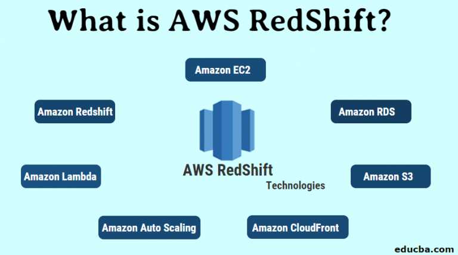
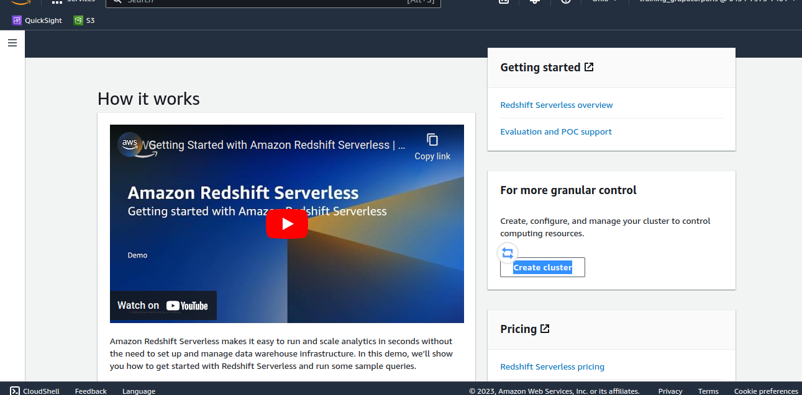
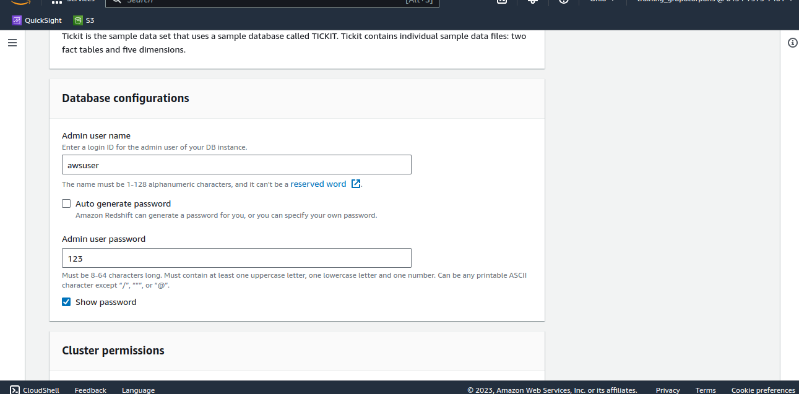
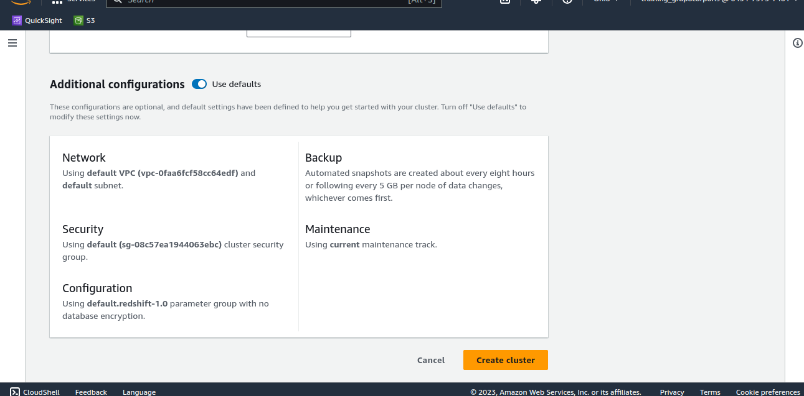
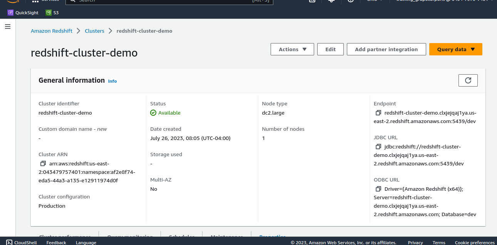
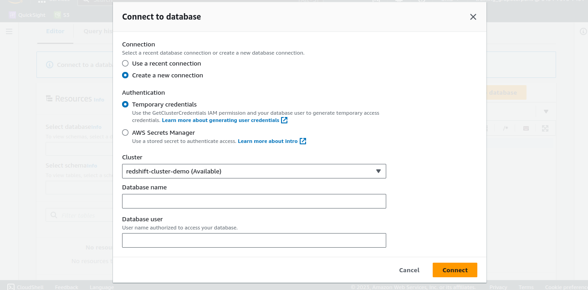
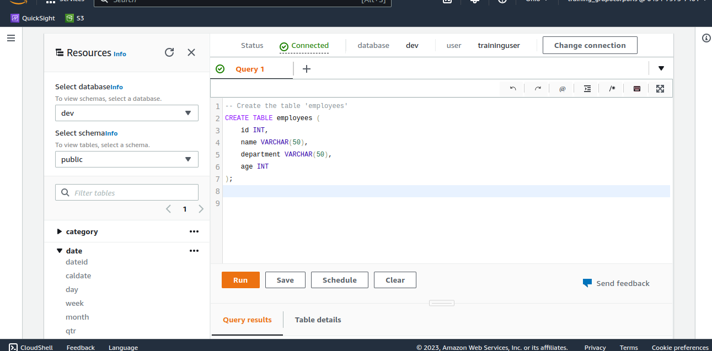
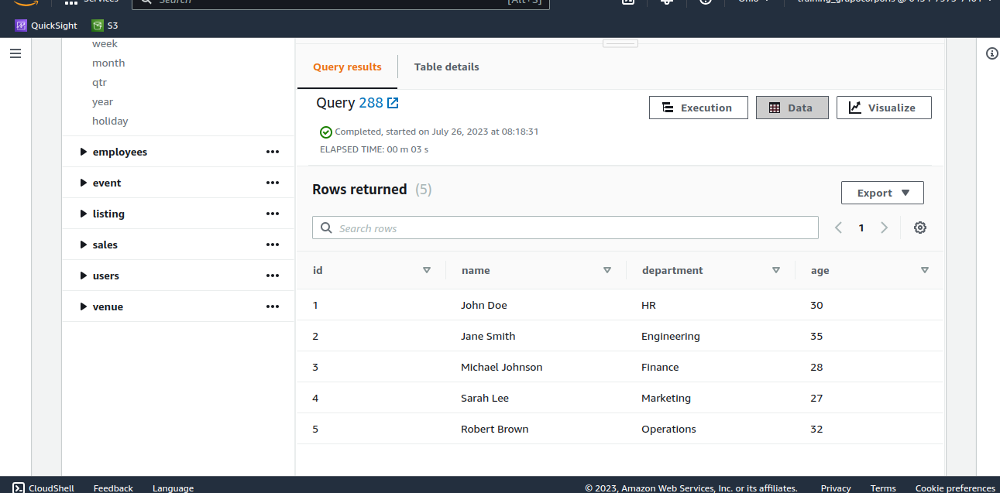

# Set up AwS Redshift Cluster and Load Data

## Objectives

-   Set up a Redshift cluster on AWS with the desired configuration, including choosing the appropriate instance types, number of nodes, and network settings. Ensure that the cluster is properly configured to meet the testing requirements.

-   Verify and test the functionality of the Query Editor provided by Amazon Redshift. Test various SQL queries and statements to validate that the editor works as expected, allowing for querying and analyzing the loaded test data.

-   Load test data into the Redshift cluster from various sources such as S3, RDS, or other databases. Use the COPY command or any other suitable method to efficiently load the data, ensuring data integrity and correctness.

## Presentation



Frequently, we encounter a common question regarding the pre-existing
location of the data warehouse and data processing before adopting AWS
Tool. Initially, we relied on physical servers and databases to manage
data and its processing, which worked fine for modest data loads.
However, as data size exponentially grew, queries and data handling
became challenging, resulting in lengthy query execution times.

To address this issue, Amazon Redshift emerged as a solution. It offered
significantly faster performance, high scalability, and efficient data
storage and processing capabilities. With its vast storage capacity and
transparent pricing, Amazon Redshift proved to be a valuable solution
for handling and manufacturing data effectively.


**Advantages**

-   High Speed:

-   Bulk Data Processing

-   Minimal Data Loss

-   Cost-Effective

-   SQL Interface

-   Security

## Lab Setup

<center>

Time of performing | Required AWS services
--------------------|-----------------------
   20 minutes      |     Redshift

</center>

## Steps

1.  Create the cluster on Redshift

2.  Verification of the environment

3.  Data loading and Query Editor

4.  Clean and free up all resources used so far

## Step 1 - Create the cluster on Redshift









## Step 2 - Verification of the environment





## Step 3 - Data loading and Query Editor





```sql
-- Create the table 'employees'
CREATE TABLE employees (
    id INT,
    name VARCHAR(50),
    department VARCHAR(50),
    age INT
);

-- Inserting records into the 'employees' table
INSERT INTO employees (id, name, department, age) VALUES
(1, 'John Doe', 'HR', 30),
(2, 'Jane Smith', 'Engineering', 35),
(3, 'Michael Johnson', 'Finance', 28),
(4, 'Sarah Lee', 'Marketing', 27),
(5, 'Robert Brown', 'Operations', 32);

```







## Step 4: Clean and free up all resources used so far

## References

[Creating a Redshift Cluster](https://docs.aws.amazon.com/redshift/latest/dg/tutorial-loading-data-create-cluster.html)

[Amazon Redshift Query Editor](https://docs.aws.amazon.com/redshift/latest/dg/c_query_editor.html)

[Amazon Redshift Developer Guide](https://docs.aws.amazon.com/redshift/latest/dg/welcome.html)
