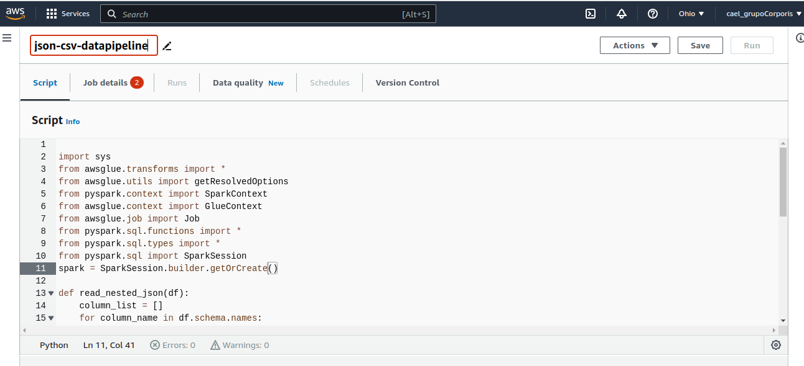
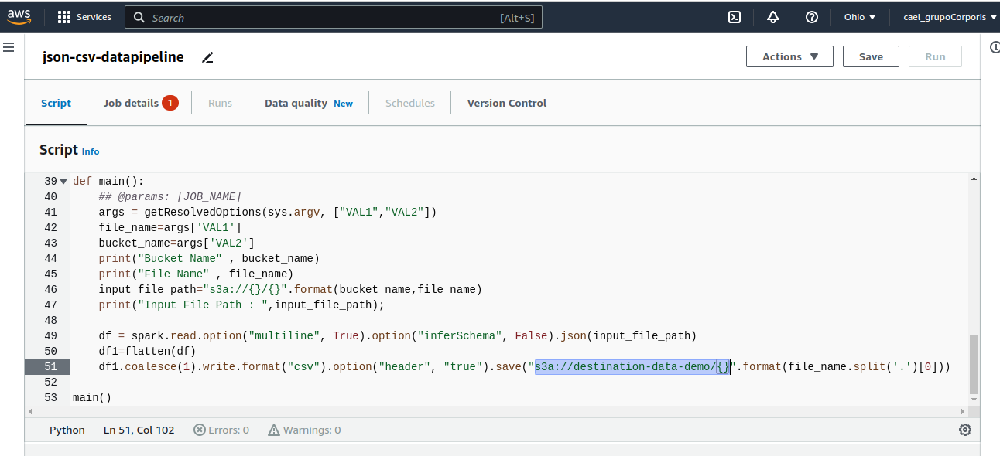
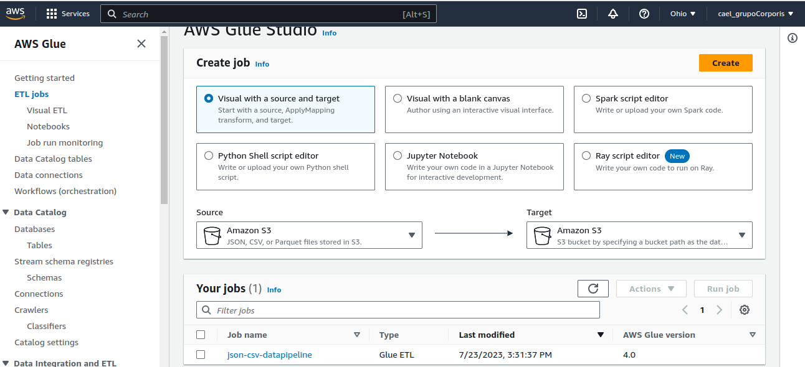

<style>
  img {
    width: 7.334645669291339in;
    height: 3.3472222222222223in;
    display: block;
    margin: 0 auto;
  }
</style>

# Automated Data Pipeline using SPARK, AWS GLUE, LAMBDA & S3

## Objectives

- Develop an automated data pipeline to process large volumes of data efficiently using Apache Spark, leveraging its distributed computing capabilities.
- Integrate data from various sources into a unified and structured format using AWS Glue, a fully managed ETL (Extract, Transform, Load) service.
- Utilize AWS Lambda to enable real-time data processing, allowing for immediate actions and insights based on incoming data streams.
- Implement a reliable and scalable data storage solution using Amazon S3.
- Set up comprehensive monitoring and alerting mechanisms to proactively identify and address any issues within the data pipeline.

<center>
<div style="text-align: center;">

| Time of performing  | 30 minutes                                   |
|---------------------|----------------------------------------------|
| Required services   | Amazon S3, Glue, Lambda, CloudWatch, and PySpark |

</div>
</center>

## Step 1: Source and destination S3 bucket

Pay attention to bucket names in order to avoid confusing them with others and endeavor to commit descriptive names for each one. Once created, no more editions are needed on this step.

Create a source S3 bucket considering the following settings.


Create a destination S3 bucket considering the following settings.


## Step 2: Create a role for Glue

Throughout this step, we will create a specific Glue role by granting access to CloudWatch for tracking the logs and to S3 for storing outputs after running the pipelines.

Choose IAM service.


Choose the case AWS service Glue and press next.


For this role, we just need to permit full access to S3 and CloudWatch. Press next afterward.


Ensure the name of the role is descriptive to match those services that are intended. Fulfill a description is optional.


Finally, create the role.


## Step 3: Create a Lambda role

Similar to step two, we will be reviewing sufficient permissions by creating a specific role for the AWS Lambda service, granting access to CloudWatch, S3 storing, and Glue.

Choose IAM service.


Press on *Create role* button.


Select the following permissions policies. Finally, press the create *role* button.


## Step 4: Create a Lambda function

Creating a function on Lambda or serverless will let us communicate our data stored at the source S3 bucket with AWS Glue every time that one file is uploaded.

In the searcher, type Lambda and click on the service.


When you are in, press "create a function". Make sure on its name and python version to use.


Choose the role configured in step 3 and press create function.


Once created the function, select the source of the function that will work as a trigger. It means that every time you want to activate the function, then uploading data into the source storage will be required. So, click on "Add trigger", and choose S3 as storage, in addition, select the bucket that you created as the source. Ensure of following the rest of the configuration as it is presented below.


We will see the data source has been chosen.


Change the tab to *code.*


Paste this code:

```python
import json
import boto3

def lambda_handler(event, context):
    file_name = event['Records'][0]['s3']['object']['key']
    bucketName = event['Records'][0]['s3']['bucket']['name']
    print("File Name: ", file_name)
    print("Bucket Name: ", bucketName)

    glue = boto3.client('glue')
    response = glue.start_job_run(JobName="s3_lambda_glue_s3", Arguments={"--VAL1": file_name, "--VAL2": bucketName})
    print("Lambda Invoke")
```
Verify to change the name what AWS Glue will be named with.


Deploy the function by pressing the button *Deploy*


## Step 5: Create a Glue data pipeline job 

It is important to mention the design of pipelines should take into account reliability. So this configuration will not outline this approach but will highlight the pragmatic usage of the tool including distributed computing by pyspark.

Look for AWS glue in the searcher and click it.


On the left side press on ETL jobs and select the option *Spark script editor*. Subsequently, click on *Create* job.


Guarantee that its name is congruent with step 4, i.e. the Glue's name job is consistent after triggering the lambda function that will look for activating this current job.



Paste this code:

```python

import sys

from awsglue.transforms import \*

from awsglue.utils import getResolvedOptions

from pyspark.context import SparkContext

from awsglue.context import GlueContext

from awsglue.job import Job

from pyspark.sql.functions import \*

from pyspark.sql.types import \*

from pyspark.sql import SparkSession

spark = SparkSession.builder.getOrCreate()

def read_nested_json(df):

column_list = \[\]

for column_name in df.schema.names:

if isinstance(df.schema\[column_name\].dataType, ArrayType):

df = df.withColumn(column_name,explode(column_name))

column_list.append(column_name)

elif isinstance(df.schema\[column_name\].dataType, StructType):

for field in df.schema\[column_name\].dataType.fields:

column_list.append(col(column_name + \".\" +
field.name).alias(column_name + \"\_\" + field.name))

else:

column_list.append(column_name)

df = df.select(column_list)

return df

def flatten(df):

read_nested_json_flag = True

while read_nested_json_flag:

df = read_nested_json(df);

read_nested_json_flag = False

for column_name in df.schema.names:

if isinstance(df.schema\[column_name\].dataType, ArrayType):

read_nested_json_flag = True

elif isinstance(df.schema\[column_name\].dataType, StructType):

read_nested_json_flag = True;

return df;

def main():

\## \@params: \[JOB_NAME\]

args = getResolvedOptions(sys.argv, \[\"VAL1\",\"VAL2\"\])

file_name=args\[\'VAL1\'\]

bucket_name=args\[\'VAL2\'\]

print(\"Bucket Name\" , bucket_name)

print(\"File Name\" , file_name)

input_file_path=\"s3a://{}/{}\".format(bucket_name,file_name)

print(\"Input File Path : \",input_file_path);

df = spark.read.option(\"multiline\", True).option(\"inferSchema\",
False).json(input_file_path)

df1=flatten(df)

df1.coalesce(1).write.format(\"csv\").option(\"header\",
\"true\").save(\"s3a://destination-data-demo/{}\".format(file_name.split(\'.\')\[0\]))

main()

```

Review the code previously and establish that destination S3 bucket is
figuring in the code as follows.



Review additional details like name, description, and bind the role
created in step 2.


Select the environment of development that will make sure to run the
data pipeline by spark algorithms.


Keep these options selected because it would be useful to optimize
costs. And, press *Save.*


Upon saving the script and its configuration will show up a message of
the updating.


Look for the *ETL jobs* after successfully creating the script to see
the job.



## Step 6: Activate the Lambda function and Glue job

Now, the memento of verification that our data pipeline is flatting our
JSON data structured to CSV format has come. First, we need to write a
file, save it, and upload it to the source storage in S3 so our lambda
function will note this new file after being triggered during the
uploading. The serverless function will activate the glue job. Finally,
the data pipeline will process the data import to output as a CSV file at
the destination storage S3 bucket.

Write a JSON file.

```json
{
  "firstName": "Cael",
  "lastName": "Tarifa",
  "age": 30,
  "address": {
    "streetAddress": "Av Balmaceda",
    "city": "Santiago",
    "state": "Metropolitan region of Santiago",
    "postalCode": "55433"
  },
  "phoneNumber": [
    {
      "type": "office",
      "number": "22397328"
    },
    {
      "type": "private",
      "number": "38489200"
    }
  ]
}
```

Go to the source S3 bucket and add the file written.


Once the file has been uploaded, the trigger has automatically been
activated.


Let's see in the tab of *Monitor* from our lambda function. And open an
external tab after clicking on *View CloudWatch Logs* button*.*


AWS CloudWatch service is opened, and click on *Search log group.*


We see the last logs which can verify the activity of our function. It
was on.


On the left side, press *Log Groups* to see all the last log streams
that ran.


Now, let's verify that our ETL job on Glue is working accordingly by
reachin Glue service again and clicking the job.


It seems that our job has successfully been activated. Indeed, a new
file after running the pipeline has been created.


## Step 7: Verification of the success of flattening

At last and after running all processes above, let's verify that our
file has been addressed properly in the right place or intended place.

Search for S3 service.


Click on the destination storing bucket.


Select the folder where it would be as the outcome and click on the
file.


Click on *Download*.


Let's verify that our data pipeline has processed all those steps on AWS
cloud services according to the design in order to get a CSV file as the
outcome.


## Step 8: Clean and free up all resources used so far

## References

[[Building a reliable data
pipeline]{.underline}](https://docs.aws.amazon.com/whitepapers/latest/aws-glue-best-practices-build-secure-data-pipeline/building-a-reliable-data-pipeline.html)

[[AWS Glue Developer
Guide]{.underline}](https://docs.aws.amazon.com/glue/latest/dg/what-is-glue.html)

[[Passing and accessing Python parameters in AWS
Glue]{.underline}](https://docs.aws.amazon.com/glue/latest/dg/aws-glue-programming-python-calling.html)
